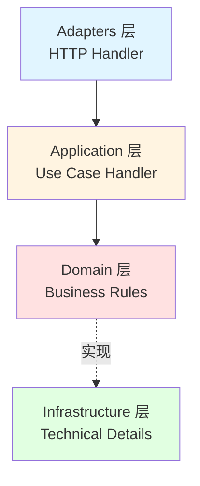
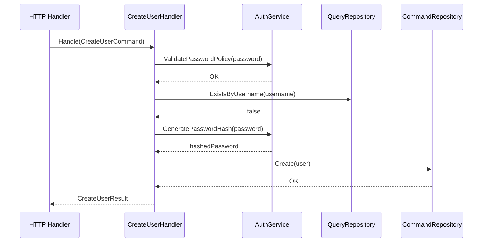

# DDD + CQRS 架构详解

本项目采用**标准 DDD 四层架构 + CQRS 模式**，实现了业务逻辑与技术实现的完全分离。

## 📐 架构概览

### 四层架构



**依赖方向**: Adapters → Application → Domain ← Infrastructure (严格单向)

### 各层职责

#### 1. Adapters 层 (接口适配)
- **位置**: `internal/adapters/http/handler/`
- **职责**: HTTP 请求/响应转换，不包含业务逻辑
- **示例**: `AuthHandler`, `UserHandler`

```go
// ✅ 正确：仅做 HTTP 转换
func (h *UserHandler) Create(c *gin.Context) {
    var req CreateUserRequest
    c.ShouldBindJSON(&req)

    result, err := h.createUserHandler.Handle(ctx, command.CreateUserCommand{
        Username: req.Username,
        Email:    req.Email,
    })

    response.Created(c, result)
}

// ❌ 错误：在 Handler 中写业务逻辑
func (h *UserHandler) Create(c *gin.Context) {
    // 检查用户名是否存在 ← 业务逻辑，应该在 Use Case 中
    // 验证密码强度 ← 业务逻辑，应该在 Domain Service 中
}
```

#### 2. Application 层 (业务编排)
- **位置**: `internal/application/*/command/` 和 `query/`
- **职责**: 协调领域模型和仓储完成业务用例
- **结构**: Command/Query + Handler

```go
type CreateUserHandler struct {
    userCommandRepo user.CommandRepository
    userQueryRepo   user.QueryRepository
    authService     domainAuth.Service
}

func (h *CreateUserHandler) Handle(ctx context.Context, cmd CreateUserCommand) (*CreateUserResult, error) {
    // 1. 验证密码策略
    h.authService.ValidatePasswordPolicy(ctx, cmd.Password)

    // 2. 检查唯一性
    exists, _ := h.userQueryRepo.ExistsByUsername(ctx, cmd.Username)
    if exists {
        return nil, user.ErrUsernameAlreadyExists
    }

    // 3. 生成密码哈希
    hashedPassword, _ := h.authService.GeneratePasswordHash(ctx, cmd.Password)

    // 4. 创建用户
    newUser := &user.User{
        Username: cmd.Username,
        Email:    cmd.Email,
        Password: hashedPassword,
    }
    h.userCommandRepo.Create(ctx, newUser)

    return &CreateUserResult{UserID: newUser.ID}, nil
}
```

#### 3. Domain 层 (业务规则)
- **位置**: `internal/domain/`
- **职责**: 定义业务模型、领域服务接口、仓储接口
- **特点**: 不依赖任何外层，纯业务逻辑

**富领域模型示例**:
```go
type User struct {
    ID       uint
    Username string
    Password string
    Status   string
    Roles    []Role
}

// 业务行为方法
func (u *User) CanLogin() bool {
    return u.Status == "active" && !u.IsBanned()
}

func (u *User) Activate() {
    u.Status = "active"
}

func (u *User) Ban() {
    u.Status = "banned"
}

func (u *User) AssignRole(role *Role) {
    u.Roles = append(u.Roles, *role)
}
```

**仓储接口**:
```go
// CommandRepository - 写操作
type CommandRepository interface {
    Create(ctx context.Context, user *User) error
    Update(ctx context.Context, user *User) error
    Delete(ctx context.Context, id uint) error
    AssignRoles(ctx context.Context, userID uint, roleIDs []uint) error
}

// QueryRepository - 读操作
type QueryRepository interface {
    GetByID(ctx context.Context, id uint) (*User, error)
    GetByIDWithRoles(ctx context.Context, id uint) (*User, error)
    List(ctx context.Context, offset, limit int) ([]*User, error)
    ExistsByUsername(ctx context.Context, username string) (bool, error)
    ExistsByEmail(ctx context.Context, email string) (bool, error)
}
```

#### 4. Infrastructure 层 (技术实现)
- **位置**: `internal/infrastructure/`
- **职责**: 实现领域服务、仓储、数据库、Redis、外部API

```go
// 实现 Domain Service
type AuthServiceImpl struct {
    jwtManager      *JWTManager
    tokenGenerator  *TokenGenerator
    passwordPolicy  domainAuth.PasswordPolicy
}

func (s *AuthServiceImpl) ValidatePasswordPolicy(ctx context.Context, password string) error {
    if len(password) < s.passwordPolicy.MinLength {
        return domainAuth.ErrPasswordTooShort
    }
    // ... 更多验证
}

// 实现 Repository
type userCommandRepository struct {
    db *gorm.DB
}

func (r *userCommandRepository) Create(ctx context.Context, user *user.User) error {
    return r.db.WithContext(ctx).Create(user).Error
}
```

---

## 🗂️ CQRS 模式详解

### Command（命令 - 写操作）

**完整流程**:



**代码示例**:
```go
// 1. 定义 Command（纯数据对象）
type CreateUserCommand struct {
    Username string
    Email    string
    Password string
    FullName string
}

// 2. 定义 Handler（业务编排）
type CreateUserHandler struct {
    userCommandRepo user.CommandRepository
    userQueryRepo   user.QueryRepository
    authService     domainAuth.Service
}

func NewCreateUserHandler(
    userCommandRepo user.CommandRepository,
    userQueryRepo user.QueryRepository,
    authService domainAuth.Service,
) *CreateUserHandler {
    return &CreateUserHandler{
        userCommandRepo: userCommandRepo,
        userQueryRepo:   userQueryRepo,
        authService:     authService,
    }
}

func (h *CreateUserHandler) Handle(ctx context.Context, cmd CreateUserCommand) (*CreateUserResult, error) {
    // 业务编排...
}
```

### Query（查询 - 读操作）

```go
// 1. 定义 Query（纯数据对象）
type GetUserQuery struct {
    UserID    uint
    WithRoles bool
}

// 2. 定义 Handler（查询处理）
type GetUserHandler struct {
    userQueryRepo user.QueryRepository
}

func (h *GetUserHandler) Handle(ctx context.Context, query GetUserQuery) (*UserWithRolesResponse, error) {
    // 仅使用 Query Repository
    if query.WithRoles {
        return h.userQueryRepo.GetByIDWithRoles(ctx, query.UserID)
    }
    return h.userQueryRepo.GetByID(ctx, query.UserID)
}
```

---

## 🔗 依赖注入流程

### Container 注册顺序

```go
// 1. 基础设施
db := database.NewConnection(...)
redisClient := redisinfra.NewClient(...)

// 2. CQRS Repositories
userCommandRepo := persistence.NewUserCommandRepository(db)
userQueryRepo := persistence.NewUserQueryRepository(db)

// 3. Domain Services
passwordPolicy := domainAuth.DefaultPasswordPolicy()
authService := infraauth.NewAuthService(jwtManager, tokenGenerator, passwordPolicy)

// 4. Use Case Handlers
createUserHandler := userCommand.NewCreateUserHandler(
    userCommandRepo,
    userQueryRepo,
    authService,
)

getUserHandler := userQuery.NewGetUserHandler(userQueryRepo)

// 5. HTTP Handlers
userHandler := handler.NewUserHandler(
    createUserHandler,
    updateUserHandler,
    deleteUserHandler,
    getUserHandler,
    listUsersHandler,
)
```

---

## 📝 开发指南

### 如何添加新功能

#### 示例：添加「修改密码」功能

**1. 定义 Command**
```go
// internal/application/user/command/change_password.go
type ChangePasswordCommand struct {
    UserID      uint
    OldPassword string
    NewPassword string
}
```

**2. 定义 Handler**
```go
// internal/application/user/command/change_password_handler.go
type ChangePasswordHandler struct {
    userCommandRepo user.CommandRepository
    userQueryRepo   user.QueryRepository
    authService     domainAuth.Service
}

func (h *ChangePasswordHandler) Handle(ctx context.Context, cmd ChangePasswordCommand) error {
    // 1. 获取用户
    u, _ := h.userQueryRepo.GetByID(ctx, cmd.UserID)

    // 2. 验证旧密码
    h.authService.VerifyPassword(ctx, u.Password, cmd.OldPassword)

    // 3. 验证新密码策略
    h.authService.ValidatePasswordPolicy(ctx, cmd.NewPassword)

    // 4. 更新密码
    newHash, _ := h.authService.GeneratePasswordHash(ctx, cmd.NewPassword)
    u.Password = newHash
    h.userCommandRepo.Update(ctx, u)

    return nil
}
```

**3. 在 HTTP Handler 中使用**
```go
// internal/adapters/http/handler/user.go
func (h *UserHandler) ChangePassword(c *gin.Context) {
    var req ChangePasswordRequest
    c.ShouldBindJSON(&req)

    err := h.changePasswordHandler.Handle(c.Request.Context(), userCommand.ChangePasswordCommand{
        UserID:      getUserIDFromContext(c),
        OldPassword: req.OldPassword,
        NewPassword: req.NewPassword,
    })

    if err != nil {
        response.BadRequest(c, err.Error())
        return
    }

    response.OK(c, gin.H{"message": "password changed successfully"})
}
```

**4. 在 Container 中注册**
```go
// internal/bootstrap/container.go
changePasswordHandler := userCommand.NewChangePasswordHandler(
    userCommandRepo,
    userQueryRepo,
    authService,
)

userHandler := handler.NewUserHandler(
    createUserHandler,
    updateUserHandler,
    deleteUserHandler,
    changePasswordHandler,  // 新增
    getUserHandler,
    listUsersHandler,
)
```

---

## 🆚 架构对比

| 维度 | 旧架构 | 新架构（DDD + CQRS） |
|-----|-------|-------------------|
| **分层** | 3 层 | 4 层（+ Application） |
| **业务逻辑位置** | 散落在 Handler 和 Infrastructure Service | 集中在 Application Layer |
| **Repository** | 读写混合 | CQRS 读写分离 |
| **Handler 职责** | HTTP 转换 + 业务逻辑 | 仅 HTTP 转换 |
| **可测试性** | 中等（需要 HTTP 上下文） | 优秀（Use Case 可独立测试） |
| **Domain 模型** | 贫血模型 | 富领域模型 |
| **查询优化** | 困难 | 容易（Query Repository 可接 Redis/ES） |

---

## 🚀 优势

### 1. 职责分离清晰
- Handler：HTTP 请求转换
- Use Case：业务编排
- Domain Service：领域能力
- Repository：数据访问

### 2. 可测试性强
```go
// 测试 Use Case Handler（无需 HTTP 上下文）
func TestCreateUserHandler(t *testing.T) {
    mockCommandRepo := &MockUserCommandRepository{}
    mockQueryRepo := &MockUserQueryRepository{}
    mockAuthService := &MockAuthService{}

    handler := NewCreateUserHandler(mockCommandRepo, mockQueryRepo, mockAuthService)

    result, err := handler.Handle(context.Background(), CreateUserCommand{
        Username: "test",
        Email:    "test@example.com",
        Password: "password123",
    })

    assert.NoError(t, err)
    assert.NotNil(t, result)
}
```

### 3. 易于扩展
- 添加新 Use Case 不影响现有代码
- Query Repository 可独立优化（Redis/Elasticsearch）
- Domain Service 可替换实现

### 4. 业务意图明确
```go
// 旧代码
POST /api/users + UserCreateDTO

// 新代码
CreateUserCommand {
    Username: "john"
    Email: "john@example.com"
    Password: "***"
}
→ CreateUserHandler.Handle()
```

---

## 📚 相关资源

- [架构迁移指南](./migration-guide.md) - 详细重构过程
- [CLAUDE.md](../../CLAUDE.md) - 项目开发指导
- Domain-Driven Design (Eric Evans)
- CQRS Pattern (Martin Fowler)

---

**架构版本**：2.0 (DDD + CQRS)
**最后更新**：2025-11-19
