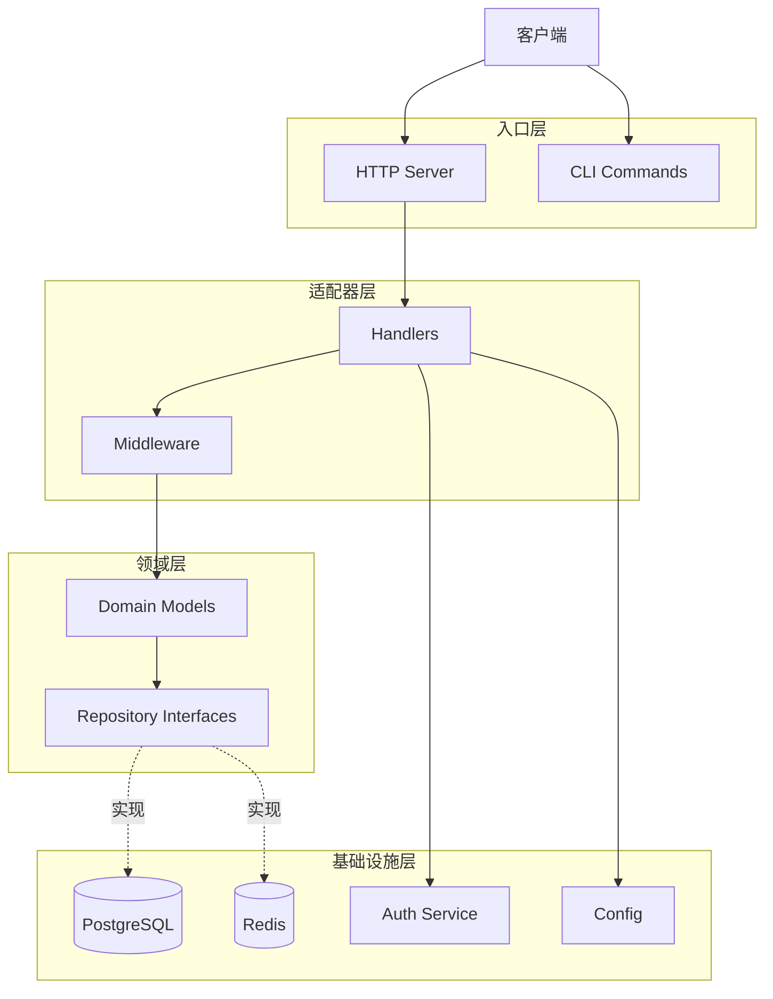
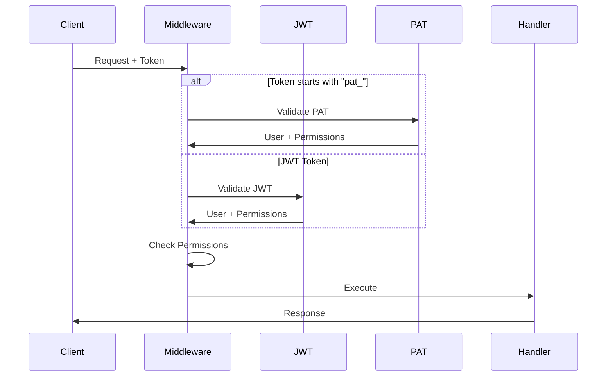

# 架构文档说明

本目录包含 Go DDD Template 项目的系统架构文档。

## 📚 文档列表

### 核心架构

- **[架构概览](./index.md)** - 架构文档首页，快速了解整体架构
- **[架构设计](./overview.md)** - DDD 分层架构、依赖注入、设计模式详解

### 认证与授权

- **[认证机制](./authentication.md)** - JWT 认证流程、会话管理、安全机制
- **[RBAC 权限系统](./rbac.md)** - 三段式权限格式、通配符匹配、审计日志
- **[Personal Access Token](./pat.md)** - PAT 使用指南、API Token 管理

### 数据层

- **[PostgreSQL 架构](./postgresql.md)** - 数据模型设计、GORM ORM、迁移策略
- **[Redis 架构](./redis.md)** - 缓存策略、分布式锁、会话存储

## 🎯 文档定位

### 目标读者

- **架构师** - 了解系统整体设计和技术选型
- **高级开发者** - 深入理解各模块的实现原理
- **技术决策者** - 评估技术方案和扩展性

### 内容特点

- ✅ 深入技术细节
- ✅ 解释设计决策
- ✅ 包含架构图和流程图
- ✅ 提供代码实现示例
- ✅ 讨论性能优化和扩展性

## 📖 快速导航

### 我想了解...

#### 权限系统如何工作？

1. 先阅读 [RBAC 权限系统](./rbac.md) 了解三段式权限格式
2. 理解 JWT Token 如何携带权限信息
3. 学习中间件如何进行权限检查
4. 查看通配符权限的匹配规则

#### 如何使用 Personal Access Token？

1. 阅读 [Personal Access Token](./pat.md) 完整指南
2. 了解 PAT vs JWT 的区别
3. 学习如何创建和管理 Token
4. 查看多语言使用示例

#### 系统的整体架构是怎样的？

1. 从 [架构概览](./index.md) 开始
2. 深入阅读 [架构设计](./overview.md)
3. 了解各层的职责和依赖关系
4. 学习核心设计模式

#### 数据库是如何设计的？

1. 阅读 [PostgreSQL 架构](./postgresql.md)
2. 了解领域模型和数据表映射
3. 学习 GORM 的使用技巧
4. 查看迁移和种子数据策略

## 🔗 相关文档

- **[用户指南](/guide/)** - 如何使用和部署应用
- **[API 参考](/api/)** - API 接口详细说明
- **[开发文档](/development/)** - 开发工具和文档系统

## 💡 架构亮点

### 1. 三段式细粒度权限

```
domain:resource:action
  ↓       ↓       ↓
admin:users:create  # 管理员域-用户资源-创建操作
user:profile:read   # 用户域-个人资料-读取操作
api:cache:write     # API域-缓存-写入操作
```

**特性**:
- 支持通配符匹配（`admin:users:*`）
- 细粒度权限控制
- 灵活的权限委派

### 2. 双重认证机制

| 认证方式 | 适用场景 | 特点 |
|---------|---------|------|
| **JWT** | Web 应用、移动应用 | 短期、可刷新、无状态 |
| **PAT** | API 集成、CLI 工具 | 长期、权限子集、可撤销 |

**优势**:
- JWT 用于用户交互场景
- PAT 用于自动化和集成场景
- 统一的认证中间件自动识别

### 3. DDD 分层架构

```
Commands/HTTP (入口层)
    ↓
Adapters (适配器层)
    ↓
Application (应用层) - 未来扩展
    ↓
Domain (领域层) - 核心业务逻辑
    ↑
Infrastructure (基础设施层) - 技术实现
```

**原则**:
- 依赖倒置：外层依赖内层
- Domain 层不依赖任何框架
- Infrastructure 实现 Domain 定义的接口

### 4. 审计日志系统

**自动记录**:
- 所有写操作（POST、PUT、DELETE）
- 操作者信息（UserID、Username）
- 操作时间、IP 地址、User Agent
- 操作状态（成功/失败）

**查询功能**:
- 按用户查询
- 按资源查询
- 按时间范围查询
- 按状态过滤

## 🚀 技术栈

### 后端核心

- **HTTP 框架**: Gin
- **ORM**: GORM
- **缓存**: Redis (go-redis)
- **配置**: Koanf
- **JWT**: golang-jwt/jwt/v5
- **日志**: slog

### 数据存储

- **主数据库**: PostgreSQL 14+
- **缓存**: Redis 7+

## 📊 架构图

### 整体架构



### 认证流程



## 🔒 安全特性

### 认证层

- ✅ bcrypt 密码哈希（cost=10）
- ✅ JWT HMAC-SHA256 签名
- ✅ Token 短期有效（1小时）
- ✅ Refresh Token 机制
- ✅ PAT SHA-256 哈希存储

### 授权层

- ✅ 三段式细粒度权限
- ✅ 通配符权限匹配
- ✅ 最小权限原则（PAT 权限子集）
- ✅ IP 白名单（PAT）
- ✅ 角色分离（admin/user）

### 审计层

- ✅ 完整操作日志
- ✅ 用户追踪
- ✅ 异步写入（不阻塞请求）
- ✅ 可查询、可导出

## 📝 扩展阅读

### 设计模式

- **仓储模式**: `Domain` 定义接口，`Infrastructure` 实现
- **依赖注入**: 统一的容器管理组件生命周期
- **中间件模式**: 洋葱模型的请求处理
- **策略模式**: 多种认证方式的统一接口

### 性能优化

- **数据库优化**: 预加载、索引、连接池
- **缓存策略**: 查询缓存、分布式锁
- **并发处理**: Context 超时控制、异步处理

### 可扩展性

- **水平扩展**: 无状态设计、读写分离
- **垂直扩展**: 模块化、接口抽象
- **配置驱动**: 运行时配置调整

## 🤝 贡献

如果您想为架构文档做出贡献：

1. 确保内容属于架构层面（而非使用指南）
2. 包含设计决策和实现原理
3. 添加架构图和流程图
4. 提供代码示例
5. 更新导航配置

欢迎通过 Pull Request 提交您的贡献！
