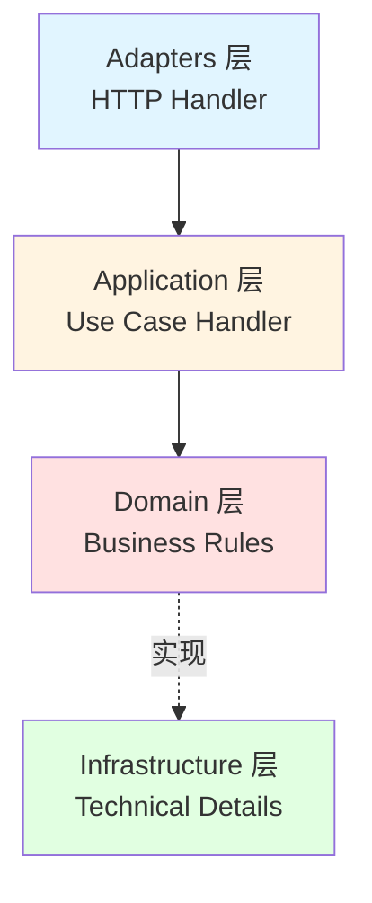
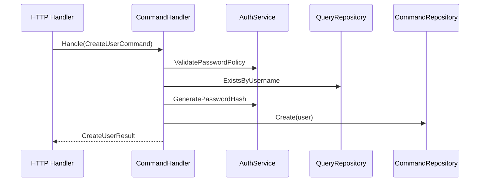

# DDD + CQRS 架构详解

本项目采用**标准 DDD 四层架构 + CQRS 模式**，实现了业务逻辑与技术实现的完全分离。

<!--TOC-->

## Table of Contents

- [架构概览](#架构概览) `:22+29`
  - [四层架构](#四层架构) `:24+16`
  - [各层职责](#各层职责) `:40+11`
- [CQRS 模式](#cqrs-模式) `:51+28`
  - [Command（写操作）](#command写操作) `:53+20`
  - [Query（读操作）](#query读操作) `:73+6`
- [依赖注入](#依赖注入) `:79+13`
- [设计案例](#设计案例) `:92+9`
- [架构对比](#架构对比) `:101+10`
- [实现状态](#实现状态) `:111+13`

<!--TOC-->

## 架构概览

### 四层架构

**依赖方向**: `Adapters → Application → Domain ← Infrastructure` (严格单向)

### 各层职责

| 层                 | 位置                       | 职责               | 关键约束           |
| ------------------ | -------------------------- | ------------------ | ------------------ |
| **Adapters**       | `internal/adapters/`       | HTTP 请求/响应转换 | 禁止业务逻辑       |
| **Application**    | `internal/application/`    | 业务用例编排       | Command/Query 分离 |
| **Domain**         | `internal/domain/`         | 业务规则、接口定义 | 禁止 GORM 依赖     |
| **Infrastructure** | `internal/infrastructure/` | 技术实现、数据访问 | 实现 Domain 接口   |

> 详细规范见 `.claude/rules/ddd-*.md`

## CQRS 模式

### Command（写操作）

**文件结构**: `internal/application/{模块}/cmd_*.go` + `cmd_*_handler.go`

### Query（读操作）

仅使用 QueryRepository，无副作用。可独立优化（Redis/Elasticsearch）。

**文件结构**: `internal/application/{模块}/qry_*.go` + `qry_*_handler.go`

## 依赖注入

Container 采用模块化设计，初始化顺序：

1. **Infrastructure** (DB, Redis, EventBus)
2. **Repositories** (依赖 DB)
3. **Services** (依赖 Repos, Redis)
4. **UseCases** (依赖 Repos, Services)
5. **HTTP Handlers** (依赖 UseCases)
6. **Router** (依赖 Handlers)

**入口文件**: `internal/bootstrap/container.go`

## 设计案例

| 案例                 | 设计要点                     | 代码位置                                                   |
| -------------------- | ---------------------------- | ---------------------------------------------------------- |
| **PAT Token 创建**   | 明文仅返回一次，数据库存哈希 | `internal/application/pat/cmd_create_token_handler.go`     |
| **AuditLog 查询**    | 多维度过滤，只读无 Command   | `internal/application/auditlog/qry_list_logs_handler.go`   |
| **Setting 批量更新** | 原子事务，类型安全转换       | `internal/application/setting/cmd_batch_update_handler.go` |
| **Menu 树形排序**    | 父菜单验证，防循环引用       | `internal/application/menu/cmd_reorder_menus_handler.go`   |

## 架构对比

| 维度        | 旧架构                 | DDD + CQRS           |
| ----------- | ---------------------- | -------------------- |
| 分层        | 3 层                   | 4 层 (+ Application) |
| 业务逻辑    | 散落在 Handler/Service | 集中在 Application   |
| Repository  | 读写混合               | CQRS 分离            |
| Domain 模型 | 贫血模型               | 富领域模型           |
| 可测试性    | 需要 HTTP 上下文       | Use Case 独立测试    |

## 实现状态

| 模块     | Use Cases              | 状态 |
| -------- | ---------------------- | ---- |
| Auth     | 3 Commands + 1 Query   | ✅   |
| User     | 5 Commands + 5 Queries | ✅   |
| Role     | 4 Commands + 3 Queries | ✅   |
| Menu     | 4 Commands + 2 Queries | ✅   |
| Setting  | 4 Commands + 2 Queries | ✅   |
| PAT      | 2 Commands + 2 Queries | ✅   |
| AuditLog | 0 Commands + 2 Queries | ✅   |

**统计**: 18 Command Handlers + 12 Query Handlers = 30 Use Cases
