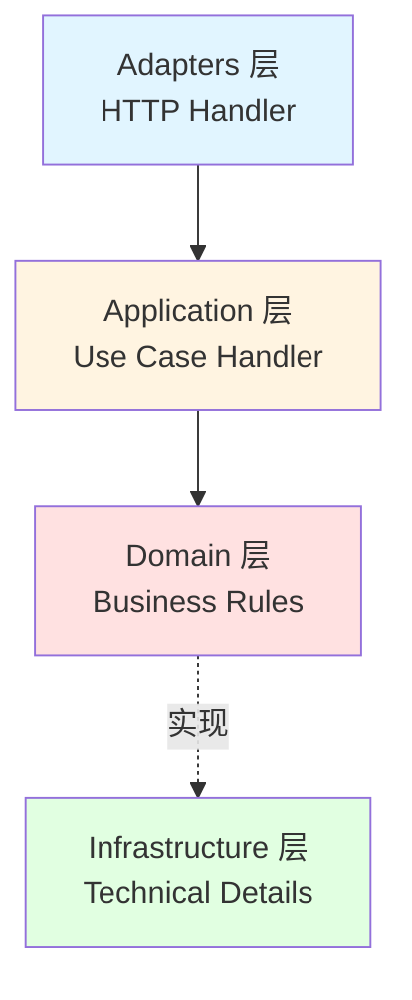
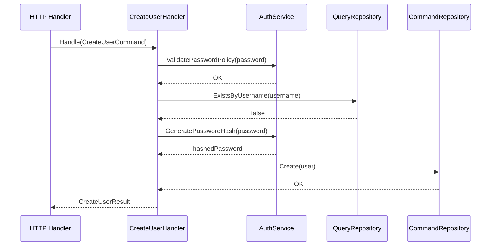

# DDD + CQRS 架构详解

本项目采用**标准 DDD 四层架构 + CQRS 模式**，实现了业务逻辑与技术实现的完全分离。

<!--TOC-->

## Table of Contents

- [架构概览](#架构概览) `:39+188`
  - [四层架构](#四层架构) `:41+16`
  - [各层职责](#各层职责) `:57+170`
- [CQRS 模式详解](#cqrs-模式详解) `:227+86`
  - [Command（命令 - 写操作）](#command命令-写操作) `:229+59`
  - [Query（查询 - 读操作）](#query查询-读操作) `:288+25`
- [依赖注入流程](#依赖注入流程) `:313+38`
  - [Container 注册顺序](#container-注册顺序) `:315+36`
- [真实实现案例](#真实实现案例) `:351+282`
  - [案例 1: PAT Token 创建 (安全设计模式)](#案例-1-pat-token-创建-安全设计模式) `:353+72`
  - [案例 2: AuditLog 复杂查询 (多维度过滤)](#案例-2-auditlog-复杂查询-多维度过滤) `:425+58`
  - [案例 3: Setting 批量更新 (事务处理)](#案例-3-setting-批量更新-事务处理) `:483+86`
  - [案例 4: Menu 树形结构排序 (复杂业务逻辑)](#案例-4-menu-树形结构排序-复杂业务逻辑) `:569+64`
- [开发指南](#开发指南) `:633+91`
  - [如何添加新功能](#如何添加新功能) `:635+89`
- [架构对比](#架构对比) `:724+14`
- [优势](#优势) `:738+54`
  - [1. 职责分离清晰](#1-职责分离清晰) `:740+7`
  - [2. 可测试性强](#2-可测试性强) `:747+22`
  - [3. 易于扩展](#3-易于扩展) `:769+6`
  - [4. 业务意图明确](#4-业务意图明确) `:775+17`
- [当前实现状态](#当前实现状态) `:792+50`
  - [完成模块清单 (2025-11-19)](#完成模块清单-2025-11-19) `:794+14`
  - [统计数据](#统计数据) `:808+22`
  - [架构完整性](#架构完整性) `:830+12`
- [相关资源](#相关资源) `:842+19`
  - [推荐阅读顺序](#推荐阅读顺序) `:848+13`

<!--TOC-->

## 架构概览

### 四层架构



**依赖方向**: Adapters → Application → Domain ← Infrastructure (严格单向)

### 各层职责

#### 1. Adapters 层 (接口适配)

- **位置**: `internal/adapters/http/handler/`
- **职责**: HTTP 请求/响应转换，不包含业务逻辑
- **示例**: `AuthHandler`, `UserHandler`

```go
// ✅ 正确：仅做 HTTP 转换
func (h *UserHandler) Create(c *gin.Context) {
    var req CreateUserRequest
    c.ShouldBindJSON(&req)

    result, err := h.createUserHandler.Handle(ctx, command.CreateUserCommand{
        Username: req.Username,
        Email:    req.Email,
    })

    response.Created(c, result)
}

// ❌ 错误：在 Handler 中写业务逻辑
func (h *UserHandler) Create(c *gin.Context) {
    // 检查用户名是否存在 ← 业务逻辑，应该在 Use Case 中
    // 验证密码强度 ← 业务逻辑，应该在 Domain Service 中
}
```

#### 2. Application 层 (业务编排)

- **位置**: `internal/application/*/command/` 和 `query/`
- **职责**: 协调领域模型和仓储完成业务用例
- **结构**: Command/Query + Handler

```go
type CreateUserHandler struct {
    userCommandRepo user.CommandRepository
    userQueryRepo   user.QueryRepository
    authService     domainAuth.Service
}

func (h *CreateUserHandler) Handle(ctx context.Context, cmd CreateUserCommand) (*CreateUserResult, error) {
    // 1. 验证密码策略
    h.authService.ValidatePasswordPolicy(ctx, cmd.Password)

    // 2. 检查唯一性
    exists, _ := h.userQueryRepo.ExistsByUsername(ctx, cmd.Username)
    if exists {
        return nil, user.ErrUsernameAlreadyExists
    }

    // 3. 生成密码哈希
    hashedPassword, _ := h.authService.GeneratePasswordHash(ctx, cmd.Password)

    // 4. 创建用户
    newUser := &user.User{
        Username: cmd.Username,
        Email:    cmd.Email,
        Password: hashedPassword,
    }
    h.userCommandRepo.Create(ctx, newUser)

    return &CreateUserResult{UserID: newUser.ID}, nil
}
```

#### 3. Domain 层 (业务规则)

- **位置**: `internal/domain/`
- **职责**: 定义业务模型、领域服务接口、仓储接口
- **特点**: 不依赖任何外层，纯业务逻辑；**禁止出现 GORM Tag 或 `gorm` 依赖**
- **与数据库映射分离**: 所有 ORM 细节放在 `internal/infrastructure/persistence/*_model.go` 中维护，通过 mapper 函数与 Domain 实体互转

**富领域模型示例**:

```go
type User struct {
    ID       uint
    Username string
    Password string
    Status   string
    Roles    []Role
}

// 业务行为方法
func (u *User) CanLogin() bool {
    return u.Status == "active" && !u.IsBanned()
}

func (u *User) Activate() {
    u.Status = "active"
}

func (u *User) Ban() {
    u.Status = "banned"
}

func (u *User) AssignRole(role *Role) {
    u.Roles = append(u.Roles, *role)
}
```

**仓储接口**:

```go
// CommandRepository - 写操作
type CommandRepository interface {
    Create(ctx context.Context, user *User) error
    Update(ctx context.Context, user *User) error
    Delete(ctx context.Context, id uint) error
    AssignRoles(ctx context.Context, userID uint, roleIDs []uint) error
}

// QueryRepository - 读操作
type QueryRepository interface {
    GetByID(ctx context.Context, id uint) (*User, error)
    GetByIDWithRoles(ctx context.Context, id uint) (*User, error)
    List(ctx context.Context, offset, limit int) ([]*User, error)
    ExistsByUsername(ctx context.Context, username string) (bool, error)
    ExistsByEmail(ctx context.Context, email string) (bool, error)
}
```

#### 4. Infrastructure 层 (技术实现)

- **位置**: `internal/infrastructure/`
- **职责**: 实现领域服务、仓储、数据库、Redis、外部 API
- **持久化模型**: 每个模块在 `internal/infrastructure/persistence/{module}_model.go` 中定义 GORM Model + 映射函数，仓储层统一通过模型 → 领域实体转换

```go
// internal/infrastructure/persistence/user_model.go
type UserModel struct {
    ID        uint           `gorm:"primaryKey"`
    Username  string         `gorm:"uniqueIndex;size:50;not null"`
    Email     string         `gorm:"uniqueIndex;size:100;not null"`
    Password  string         `gorm:"size:255;not null"`
    Status    string         `gorm:"size:20;default:'active'"`
    // ...
}

func newUserModelFromEntity(entity *user.User) *UserModel { ... }
func (m *UserModel) toEntity() *user.User { ... }

// internal/infrastructure/persistence/user_command_repository.go
type userCommandRepository struct { db *gorm.DB }

func (r *userCommandRepository) Create(ctx context.Context, entity *user.User) error {
    model := newUserModelFromEntity(entity)
    if err := r.db.WithContext(ctx).Create(model).Error; err != nil {
        return err
    }
    if saved := model.toEntity(); saved != nil {
        *entity = *saved
    }
    return nil
}

// internal/infrastructure/persistence/user_query_repository.go
func (r *userQueryRepository) GetByID(ctx context.Context, id uint) (*user.User, error) {
    var model UserModel
    if err := r.db.WithContext(ctx).First(&model, id).Error; err != nil {
        return nil, err
    }
    return model.toEntity(), nil
}
```

---

## CQRS 模式详解

### Command（命令 - 写操作）

**完整流程**:



**代码示例**:

```go
// 1. 定义 Command（纯数据对象）
type CreateUserCommand struct {
    Username string
    Email    string
    Password string
    FullName string
}

// 2. 定义 Handler（业务编排）
type CreateUserHandler struct {
    userCommandRepo user.CommandRepository
    userQueryRepo   user.QueryRepository
    authService     domainAuth.Service
}

func NewCreateUserHandler(
    userCommandRepo user.CommandRepository,
    userQueryRepo user.QueryRepository,
    authService domainAuth.Service,
) *CreateUserHandler {
    return &CreateUserHandler{
        userCommandRepo: userCommandRepo,
        userQueryRepo:   userQueryRepo,
        authService:     authService,
    }
}

func (h *CreateUserHandler) Handle(ctx context.Context, cmd CreateUserCommand) (*CreateUserResult, error) {
    // 业务编排...
}
```

### Query（查询 - 读操作）

```go
// 1. 定义 Query（纯数据对象）
type GetUserQuery struct {
    UserID    uint
    WithRoles bool
}

// 2. 定义 Handler（查询处理）
type GetUserHandler struct {
    userQueryRepo user.QueryRepository
}

func (h *GetUserHandler) Handle(ctx context.Context, query GetUserQuery) (*UserWithRolesResponse, error) {
    // 仅使用 Query Repository
    if query.WithRoles {
        return h.userQueryRepo.GetByIDWithRoles(ctx, query.UserID)
    }
    return h.userQueryRepo.GetByID(ctx, query.UserID)
}
```

---

## 依赖注入流程

### Container 注册顺序

```go
// 1. 基础设施
db := database.NewConnection(...)
redisClient := redisinfra.NewClient(...)

// 2. CQRS Repositories
userCommandRepo := persistence.NewUserCommandRepository(db)
userQueryRepo := persistence.NewUserQueryRepository(db)

// 3. Domain Services
passwordPolicy := domainAuth.DefaultPasswordPolicy()
authService := infraauth.NewAuthService(jwtManager, tokenGenerator, passwordPolicy)

// 4. Use Case Handlers
createUserHandler := userCommand.NewCreateUserHandler(
    userCommandRepo,
    userQueryRepo,
    authService,
)

getUserHandler := userQuery.NewGetUserHandler(userQueryRepo)

// 5. HTTP Handlers
userHandler := handler.NewUserHandler(
    createUserHandler,
    updateUserHandler,
    deleteUserHandler,
    getUserHandler,
    listUsersHandler,
)
```

---

## 真实实现案例

### 案例 1: PAT Token 创建 (安全设计模式)

**业务需求**:

- 创建 Personal Access Token 时，明文 Token 只能显示一次
- 系统仅存储 Token 哈希值
- 用户必须在创建时立即保存 Token

**实现位置**: `internal/application/pat/command/create_token_handler.go`

```go
type CreateTokenHandler struct {
    patCommandRepo  pat.CommandRepository
    patQueryRepo    pat.QueryRepository
    tokenGenerator  domainPAT.TokenGenerator
}

func (h *CreateTokenHandler) Handle(ctx context.Context, cmd CreateTokenCommand) (*CreateTokenResult, error) {
    // 1. 验证 Token 名称唯一性
    exists, _ := h.patQueryRepo.ExistsByUserAndName(ctx, cmd.UserID, cmd.Name)
    if exists {
        return nil, pat.ErrTokenNameAlreadyExists
    }

    // 2. 生成安全 Token（明文 + 哈希 + Token ID）
    plainToken, hashedToken, tokenID, err := h.tokenGenerator.GeneratePAT()
    if err != nil {
        return nil, fmt.Errorf("failed to generate token: %w", err)
    }

    // 3. 处理过期时间
    var expiresAt *time.Time
    if cmd.ExpiresAt != nil {
        parsedTime, _ := time.Parse(time.RFC3339, *cmd.ExpiresAt)
        expiresAt = &parsedTime
    }

    // 4. 创建 PAT 实体（仅存储哈希值）
    patEntity := &pat.PAT{
        UserID:      cmd.UserID,
        Name:        cmd.Name,
        TokenID:     tokenID,
        Token:       hashedToken,  // ⚠️ 仅存储哈希值
        Permissions: cmd.Permissions,
        ExpiresAt:   expiresAt,
    }

    if err := h.patCommandRepo.Create(ctx, patEntity); err != nil {
        return nil, fmt.Errorf("failed to create PAT: %w", err)
    }

    // 5. 返回明文 Token（仅此一次）
    return &CreateTokenResult{
        TokenID:     patEntity.ID,
        Token:       plainToken,  // ⚠️ 明文 Token，用户需立即保存
        Name:        patEntity.Name,
        Permissions: patEntity.Permissions,
        ExpiresAt:   patEntity.ExpiresAt,
        CreatedAt:   patEntity.CreatedAt,
    }, nil
}
```

**安全设计亮点**:

1. **Token 仅返回一次**: `CreateTokenResult.Token` 包含明文，后续查询不再返回
2. **哈希存储**: 数据库仅存储 `hashedToken`，无法反向推导
3. **Token ID**: 用于快速索引和验证，不泄露 Token 内容
4. **所有权验证**: 所有操作验证 `UserID`

---

### 案例 2: AuditLog 复杂查询 (多维度过滤)

**业务需求**:

- 支持按用户、操作类型、资源、状态、时间范围等多维度过滤
- 分页支持
- 审计日志只读，不可修改

**实现位置**: `internal/application/auditlog/query/list_logs_handler.go`

```go
type ListLogsHandler struct {
    auditLogQueryRepo auditlog.QueryRepository
}

func (h *ListLogsHandler) Handle(ctx context.Context, query ListLogsQuery) (*ListLogsResponse, error) {
    // 构建复杂过滤条件
    filter := auditlog.FilterOptions{
        Page:      query.Page,
        Limit:     query.Limit,
        UserID:    query.UserID,      // 可选：按用户过滤
        Action:    query.Action,      // 可选：按操作类型过滤（如 "user.create"）
        Resource:  query.Resource,    // 可选：按资源过滤（如 "/api/users"）
        Status:    query.Status,      // 可选：按状态过滤（"success" / "failure"）
        StartDate: query.StartDate,   // 可选：时间范围起始
        EndDate:   query.EndDate,     // 可选：时间范围结束
    }

    // 调用 Query Repository（可优化为 Elasticsearch）
    logs, total, err := h.auditLogQueryRepo.List(ctx, filter)
    if err != nil {
        return nil, fmt.Errorf("failed to list audit logs: %w", err)
    }

    // 转换为 DTO
    logResponses := make([]*AuditLogResponse, 0, len(logs))
    for i := range logs {
        logResponses = append(logResponses, ToAuditLogResponse(&logs[i]))
    }

    return &ListLogsResponse{
        Logs:  logResponses,
        Total: total,
        Page:  query.Page,
        Limit: query.Limit,
    }, nil
}
```

**设计特点**:

1. **Query-Only**: 无 Command Handler，日志由 AuditMiddleware 自动创建
2. **灵活过滤**: 所有过滤条件可选，支持组合查询
3. **性能优化**: QueryRepository 可替换为 Elasticsearch 实现
4. **不可变性**: 审计日志创建后不可修改或删除

---

### 案例 3: Setting 批量更新 (事务处理)

**业务需求**:

- 一次性更新多个系统设置
- 类型安全的值转换（string, int, bool, JSON）
- 原子性操作（全部成功或全部失败）

**实现位置**: `internal/application/setting/command/batch_update_handler.go`

```go
type BatchUpdateSettingsHandler struct {
    settingCommandRepo setting.CommandRepository
    settingQueryRepo   setting.QueryRepository
}

func (h *BatchUpdateSettingsHandler) Handle(ctx context.Context, cmd BatchUpdateSettingsCommand) error {
    // 验证所有设置项存在
    for _, update := range cmd.Settings {
        exists, _ := h.settingQueryRepo.ExistsByKey(ctx, update.Key)
        if !exists {
            return fmt.Errorf("setting key %s not found", update.Key)
        }
    }

    // 批量更新（Repository 层实现事务）
    return h.settingCommandRepo.BatchUpdate(ctx, cmd.Settings)
}
```

**HTTP Handler** (`internal/adapters/http/handler/setting.go:119`):

```go
func (h *SettingHandler) BatchUpdateSettings(c *gin.Context) {
    var req BatchUpdateSettingsRequest
    if err := c.ShouldBindJSON(&req); err != nil {
        response.BadRequest(c, "invalid request")
        return
    }

    // 转换为 Command
    updates := make([]settingCommand.SettingUpdate, 0, len(req.Settings))
    for _, s := range req.Settings {
        updates = append(updates, settingCommand.SettingUpdate{
            Key:   s.Key,
            Value: s.Value,
        })
    }

    // 调用 Use Case Handler
    err := h.batchUpdateSettingsHandler.Handle(c.Request.Context(),
        settingCommand.BatchUpdateSettingsCommand{
            Settings: updates,
        })

    if err != nil {
        response.BadRequest(c, err.Error())
        return
    }

    response.OK(c, gin.H{"message": "settings updated successfully"})
}
```

**类型转换器** (`internal/application/setting/converter.go`):

```go
func StringValue(setting *domainSetting.Setting) string {
    return setting.Value
}

func IntValue(setting *domainSetting.Setting) (int, error) {
    return strconv.Atoi(setting.Value)
}

func BoolValue(setting *domainSetting.Setting) (bool, error) {
    return strconv.ParseBool(setting.Value)
}

func JSONValue(setting *domainSetting.Setting, v interface{}) error {
    return json.Unmarshal([]byte(setting.Value), v)
}
```

---

### 案例 4: Menu 树形结构排序 (复杂业务逻辑)

**业务需求**:

- 菜单支持多级树形结构（ParentID）
- 支持重排序功能
- 验证父菜单存在性
- 防止循环引用

**实现位置**: `internal/application/menu/command/reorder_menus_handler.go`

```go
type ReorderMenusHandler struct {
    menuCommandRepo menu.CommandRepository
    menuQueryRepo   menu.QueryRepository
}

func (h *ReorderMenusHandler) Handle(ctx context.Context, cmd ReorderMenusCommand) error {
    // 验证所有菜单 ID 存在
    for _, item := range cmd.Menus {
        exists, _ := h.menuQueryRepo.ExistsByID(ctx, item.MenuID)
        if !exists {
            return menu.ErrMenuNotFound
        }
    }

    // 批量更新排序
    return h.menuCommandRepo.ReorderMenus(ctx, cmd.Menus)
}
```

**CreateMenuHandler 验证父菜单** (`internal/application/menu/command/create_menu_handler.go:24`):

```go
func (h *CreateMenuHandler) Handle(ctx context.Context, cmd CreateMenuCommand) (*CreateMenuResult, error) {
    // 验证父菜单存在（如果指定）
    if cmd.ParentID != nil {
        exists, _ := h.menuQueryRepo.ExistsByID(ctx, *cmd.ParentID)
        if !exists {
            return nil, menu.ErrParentMenuNotFound
        }
    }

    // 创建菜单
    menuEntity := &menu.Menu{
        Name:               cmd.Name,
        Path:               cmd.Path,
        Icon:               cmd.Icon,
        ParentID:           cmd.ParentID,
        Sort:               cmd.Sort,
        Hidden:             cmd.Hidden,
        RequiredPermission: cmd.RequiredPermission,
    }

    if err := h.menuCommandRepo.Create(ctx, menuEntity); err != nil {
        return nil, fmt.Errorf("failed to create menu: %w", err)
    }

    return &CreateMenuResult{MenuID: menuEntity.ID}, nil
}
```

---

## 开发指南

### 如何添加新功能

#### 示例：添加「修改密码」功能

**1. 定义 Command**

```go
// internal/application/user/command/change_password.go
type ChangePasswordCommand struct {
    UserID      uint
    OldPassword string
    NewPassword string
}
```

**2. 定义 Handler**

```go
// internal/application/user/command/change_password_handler.go
type ChangePasswordHandler struct {
    userCommandRepo user.CommandRepository
    userQueryRepo   user.QueryRepository
    authService     domainAuth.Service
}

func (h *ChangePasswordHandler) Handle(ctx context.Context, cmd ChangePasswordCommand) error {
    // 1. 获取用户
    u, _ := h.userQueryRepo.GetByID(ctx, cmd.UserID)

    // 2. 验证旧密码
    h.authService.VerifyPassword(ctx, u.Password, cmd.OldPassword)

    // 3. 验证新密码策略
    h.authService.ValidatePasswordPolicy(ctx, cmd.NewPassword)

    // 4. 更新密码
    newHash, _ := h.authService.GeneratePasswordHash(ctx, cmd.NewPassword)
    u.Password = newHash
    h.userCommandRepo.Update(ctx, u)

    return nil
}
```

**3. 在 HTTP Handler 中使用**

```go
// internal/adapters/http/handler/user.go
func (h *UserHandler) ChangePassword(c *gin.Context) {
    var req ChangePasswordRequest
    c.ShouldBindJSON(&req)

    err := h.changePasswordHandler.Handle(c.Request.Context(), userCommand.ChangePasswordCommand{
        UserID:      getUserIDFromContext(c),
        OldPassword: req.OldPassword,
        NewPassword: req.NewPassword,
    })

    if err != nil {
        response.BadRequest(c, err.Error())
        return
    }

    response.OK(c, gin.H{"message": "password changed successfully"})
}
```

**4. 在 Container 中注册**

```go
// internal/bootstrap/container.go
changePasswordHandler := userCommand.NewChangePasswordHandler(
    userCommandRepo,
    userQueryRepo,
    authService,
)

userHandler := handler.NewUserHandler(
    createUserHandler,
    updateUserHandler,
    deleteUserHandler,
    changePasswordHandler,  // 新增
    getUserHandler,
    listUsersHandler,
)
```

---

## 架构对比

| 维度             | 旧架构                                   | 新架构（DDD + CQRS）                   |
| ---------------- | ---------------------------------------- | -------------------------------------- |
| **分层**         | 3 层                                     | 4 层（+ Application）                  |
| **业务逻辑位置** | 散落在 Handler 和 Infrastructure Service | 集中在 Application Layer               |
| **Repository**   | 读写混合                                 | CQRS 读写分离                          |
| **Handler 职责** | HTTP 转换 + 业务逻辑                     | 仅 HTTP 转换                           |
| **可测试性**     | 中等（需要 HTTP 上下文）                 | 优秀（Use Case 可独立测试）            |
| **Domain 模型**  | 贫血模型                                 | 富领域模型                             |
| **查询优化**     | 困难                                     | 容易（Query Repository 可接 Redis/ES） |

---

## 优势

### 1. 职责分离清晰

- Handler：HTTP 请求转换
- Use Case：业务编排
- Domain Service：领域能力
- Repository：数据访问

### 2. 可测试性强

```go
// 测试 Use Case Handler（无需 HTTP 上下文）
func TestCreateUserHandler(t *testing.T) {
    mockCommandRepo := &MockUserCommandRepository{}
    mockQueryRepo := &MockUserQueryRepository{}
    mockAuthService := &MockAuthService{}

    handler := NewCreateUserHandler(mockCommandRepo, mockQueryRepo, mockAuthService)

    result, err := handler.Handle(context.Background(), CreateUserCommand{
        Username: "test",
        Email:    "test@example.com",
        Password: "password123",
    })

    assert.NoError(t, err)
    assert.NotNil(t, result)
}
```

### 3. 易于扩展

- 添加新 Use Case 不影响现有代码
- Query Repository 可独立优化（Redis/Elasticsearch）
- Domain Service 可替换实现

### 4. 业务意图明确

```go
// 旧代码
POST /api/users + UserCreateDTO

// 新代码
CreateUserCommand {
    Username: "john"
    Email: "john@example.com"
    Password: "***"
}
→ CreateUserHandler.Handle()
```

---

## 当前实现状态

### 完成模块清单 (2025-11-19)

| 模块         | Application 层 | CQRS Repository | Use Cases 数量         | 状态 |
| ------------ | -------------- | --------------- | ---------------------- | ---- |
| **Auth**     | ✅             | ✅              | 3 Commands + 1 Query   | 100% |
| **User**     | ✅             | ✅              | 5 Commands + 5 Queries | 100% |
| **Role**     | ✅             | ✅              | 4 Commands + 3 Queries | 100% |
| **Menu**     | ✅             | ✅              | 4 Commands + 2 Queries | 100% |
| **Setting**  | ✅             | ✅              | 4 Commands + 2 Queries | 100% |
| **PAT**      | ✅             | ✅              | 2 Commands + 2 Queries | 100% |
| **AuditLog** | ✅             | ✅              | 0 Commands + 2 Queries | 100% |
| **TwoFA**    | Infrastructure | ✅              | N/A (Service 实现)     | 100% |
| **Captcha**  | Infrastructure | Single Repo     | N/A (内存存储)         | 100% |

### 统计数据

**Application 层**:

- **新增文件**: 58 个
- **Use Case Handlers**: 30 个 (18 Command + 12 Query)
- **Commands/Queries**: 30 个
- **DTO 文件**: 5 个
- **Mapper 文件**: 5 个
- **代码行数**: 约 2200+ 行

**CQRS Repository**:

- **Command Repository**: 8 个
- **Query Repository**: 8 个
- **Repository 实现**: 14 个

**HTTP Handlers**:

- **重构的 Handler**: 7 个
- **新增路由**: 0 个 (所有路由已存在)

### 架构完整性

- ✅ **四层架构**: Adapters → Application → Domain ← Infrastructure
- ✅ **CQRS 分离**: 100% 读写分离
- ✅ **Use Case Pattern**: 所有业务逻辑在 Application 层
- ✅ **富领域模型**: User、Role 等模型包含业务行为
- ✅ **Domain Service**: Auth Service 接口定义
- ✅ **依赖注入**: 统一 Container 管理
- ✅ **编译成功**: 0 错误，0 警告

---

## 相关资源

- [架构迁移指南](./migration-guide.md) - 详细重构过程（包含 PAT、AuditLog 实现细节）
- Domain-Driven Design (Eric Evans)
- CQRS Pattern (Martin Fowler)

### 推荐阅读顺序

1. **入门**: 阅读本文档了解架构设计
2. **实战**: 查看"真实实现案例"学习最佳实践
3. **迁移**: 阅读 [架构迁移指南](./migration-guide.md) 了解完整迁移过程
4. **开发**: 参考"开发指南"添加新功能
5. **深入**: 阅读完成模块清单了解所有已实现功能

---

**架构版本**：2.0 (DDD + CQRS)
**实现完成度**：100%
**最后更新**：2025-11-19
