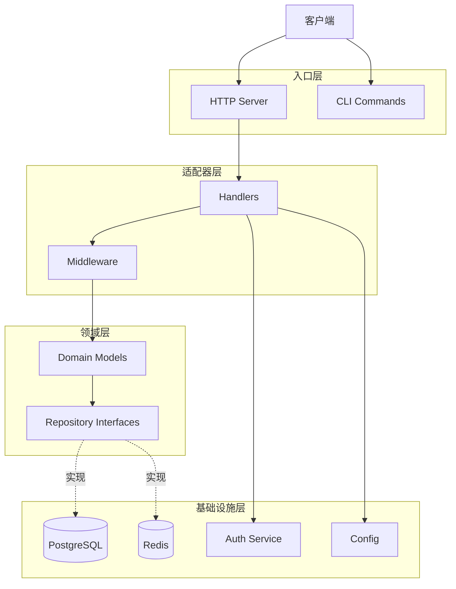
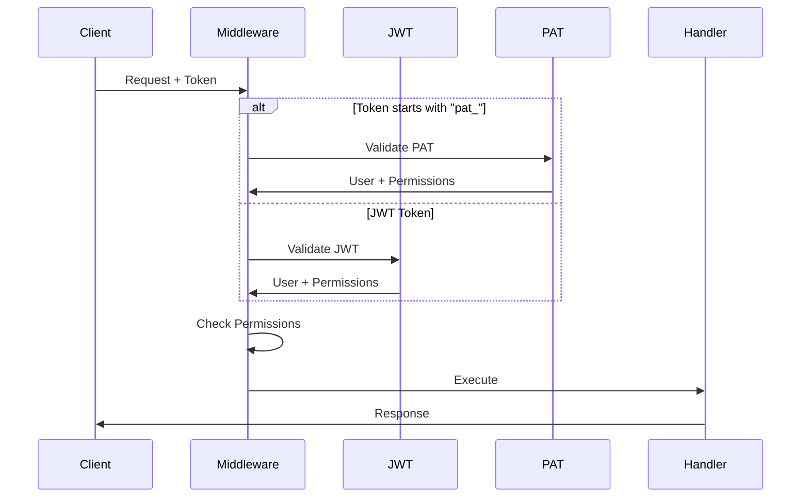

# 架构文档说明

本项目采用**领域驱动设计 (DDD)** 和 **CQRS 模式**，实现了业务逻辑与技术实现的完全分离。

::: tip 🎯 当前架构
项目已全面采用 **DDD 四层架构 + CQRS 模式**（2025-11-19 完成统一升级）

- ✅ **四层架构**: Adapters → Application → Domain ← Infrastructure
- ✅ **CQRS 模式**: Command/Query 责任分离
- ✅ **富领域模型**: 业务逻辑封装在 Domain 实体中
- ✅ **Use Case Pattern**: 业务编排集中在 Application 层

**推荐阅读顺序**:

1. [DDD + CQRS 架构详解](./ddd-cqrs.md) - 了解当前架构和分层规范
2. [架构迁移指南](./migration-guide.md) - 了解迁移过程
   :::

<!--TOC-->

## Table of Contents

- [文档列表](#文档列表) `:55+13`
  - [核心架构](#核心架构) `:57+5`
  - [技术模块](#技术模块) `:62+6`
- [文档定位](#文档定位) `:68+16`
  - [目标读者](#目标读者) `:70+6`
  - [内容特点](#内容特点) `:76+8`
- [快速导航](#快速导航) `:84+29`
  - [我想了解...](#我想了解) `:86+27`
- [相关文档](#相关文档) `:113+6`
- [架构亮点](#架构亮点) `:119+73`
  - [1. 三段式细粒度权限](#1-三段式细粒度权限) `:121+16`
  - [2. 双重认证机制](#2-双重认证机制) `:137+13`
  - [3. DDD + CQRS 四层架构](#3-ddd-cqrs-四层架构) `:150+26`
  - [4. 审计日志系统](#4-审计日志系统) `:176+16`
- [技术栈](#技术栈) `:192+16`
  - [后端核心](#后端核心) `:194+9`
  - [数据存储](#数据存储) `:203+5`
- [架构图](#架构图) `:208+67`
  - [整体架构](#整体架构) `:210+40`
  - [认证流程](#认证流程) `:250+25`
- [安全特性](#安全特性) `:275+25`
  - [认证层](#认证层) `:277+8`
  - [授权层](#授权层) `:285+8`
  - [审计层](#审计层) `:293+7`
- [扩展阅读](#扩展阅读) `:300+21`
  - [设计模式](#设计模式) `:302+7`
  - [性能优化](#性能优化) `:309+6`
  - [可扩展性](#可扩展性) `:315+6`
- [贡献](#贡献) `:321+11`

<!--TOC-->

## 文档列表

### 核心架构

- **[DDD + CQRS 架构详解](./ddd-cqrs.md)** ⭐ **推荐** - 四层架构 + CQRS 模式 + 分层规范
- **[架构迁移指南](./migration-guide.md)** - 重构过程、最佳实践、后续优化

### 技术模块

- **[前端架构](./frontend.md)** - Vue 3 + TypeScript + Vuetify 技术栈
- **[身份认证](./identity.md)** - JWT/PAT 认证、RBAC 权限系统
- **[数据存储](./data.md)** - PostgreSQL + Redis 集成

## 文档定位

### 目标读者

- **架构师** - 了解系统整体设计和技术选型
- **高级开发者** - 深入理解各模块的实现原理
- **技术决策者** - 评估技术方案和扩展性

### 内容特点

- ✅ 深入技术细节
- ✅ 解释设计决策
- ✅ 包含架构图和流程图
- ✅ 提供代码实现示例
- ✅ 讨论性能优化和扩展性

## 快速导航

### 我想了解...

#### 权限系统如何工作？

1. 阅读 [身份认证](./identity.md) 了解三段式权限格式
2. 理解 JWT Token 如何携带权限信息
3. 学习中间件如何进行权限检查
4. 查看通配符权限的匹配规则

#### 如何使用 Personal Access Token？

1. 阅读 [身份认证](./identity.md) 的 PAT 章节
2. 了解 PAT vs JWT 的区别
3. 学习如何创建和管理 Token

#### 系统的整体架构是怎样的？

1. 阅读 [DDD + CQRS 架构详解](./ddd-cqrs.md)
2. 理解迁移演进过程 [架构迁移指南](./migration-guide.md)

#### 数据库是如何设计的？

1. 阅读 [数据存储](./data.md)
2. 了解领域模型和数据表映射
3. 学习 GORM 的使用技巧
4. 查看迁移和种子数据策略

## 相关文档

- **[快速入门](/getting-started)** - 如何使用和部署应用
- **API 文档** - 运行服务后访问 `/swagger/index.html`
- **[开发指南](/development)** - 开发工具和文档系统

## 架构亮点

### 1. 三段式细粒度权限

```
domain:resource:action
  ↓       ↓       ↓
admin:users:create  # 管理员域-用户资源-创建操作
user:profile:read   # 用户域-个人资料-读取操作
api:cache:write     # API域-缓存-写入操作
```

**特性**:

- 支持通配符匹配（`admin:users:*`）
- 细粒度权限控制
- 灵活的权限委派

### 2. 双重认证机制

| 认证方式 | 适用场景           | 特点                   |
| -------- | ------------------ | ---------------------- |
| **JWT**  | Web 应用、移动应用 | 短期、可刷新、无状态   |
| **PAT**  | API 集成、CLI 工具 | 长期、权限子集、可撤销 |

**优势**:

- JWT 用于用户交互场景
- PAT 用于自动化和集成场景
- 统一的认证中间件自动识别

### 3. DDD + CQRS 四层架构

```
Adapters (适配器层) - HTTP Handler
    ↓ 依赖
Application (应用层) - Use Case Handler (Command/Query)
    ↓ 依赖
Domain (领域层) - Business Rules + Repository 接口
    ↑ 实现
Infrastructure (基础设施层) - Repository 实现 + Domain Service 实现
```

**CQRS 模式**:

- **CommandRepository**: Create, Update, Delete（写操作）
- **QueryRepository**: GetByID, List, Search（读操作）
- **优势**: 读写分离，Query 层可独立优化（Redis/Elasticsearch）

**Use Case Pattern**:

- Command Handler: 业务编排（CreateUserHandler, UpdateUserHandler）
- Query Handler: 查询处理（GetUserHandler, ListUsersHandler）
- HTTP Handler: 仅做 HTTP 转换，无业务逻辑

**详细了解**: [DDD + CQRS 架构详解](./ddd-cqrs.md)

### 4. 审计日志系统

**自动记录**:

- 所有写操作（POST、PUT、DELETE）
- 操作者信息（UserID、Username）
- 操作时间、IP 地址、User Agent
- 操作状态（成功/失败）

**查询功能**:

- 按用户查询
- 按资源查询
- 按时间范围查询
- 按状态过滤

## 技术栈

### 后端核心

- **HTTP 框架**: Gin
- **ORM**: GORM
- **缓存**: Redis (go-redis)
- **配置**: Koanf
- **JWT**: golang-jwt/jwt/v5
- **日志**: slog

### 数据存储

- **主数据库**: PostgreSQL 14+
- **缓存**: Redis 7+

## 架构图

### 整体架构



### 认证流程



## 安全特性

### 认证层

- ✅ bcrypt 密码哈希（cost=10）
- ✅ JWT HMAC-SHA256 签名
- ✅ Token 短期有效（1小时）
- ✅ Refresh Token 机制
- ✅ PAT SHA-256 哈希存储

### 授权层

- ✅ 三段式细粒度权限
- ✅ 通配符权限匹配
- ✅ 最小权限原则（PAT 权限子集）
- ✅ IP 白名单（PAT）
- ✅ 角色分离（admin/user）

### 审计层

- ✅ 完整操作日志
- ✅ 用户追踪
- ✅ 异步写入（不阻塞请求）
- ✅ 可查询、可导出

## 扩展阅读

### 设计模式

- **仓储模式**: `Domain` 定义接口，`Infrastructure` 实现
- **依赖注入**: 统一的容器管理组件生命周期
- **中间件模式**: 洋葱模型的请求处理
- **策略模式**: 多种认证方式的统一接口

### 性能优化

- **数据库优化**: 预加载、索引、连接池
- **缓存策略**: 查询缓存、分布式锁
- **并发处理**: Context 超时控制、异步处理

### 可扩展性

- **水平扩展**: 无状态设计、读写分离
- **垂直扩展**: 模块化、接口抽象
- **配置驱动**: 运行时配置调整

## 贡献

如果您想为架构文档做出贡献：

1. 确保内容属于架构层面（而非使用指南）
2. 包含设计决策和实现原理
3. 添加架构图和流程图
4. 提供代码示例
5. 更新导航配置

欢迎通过 Pull Request 提交您的贡献！
