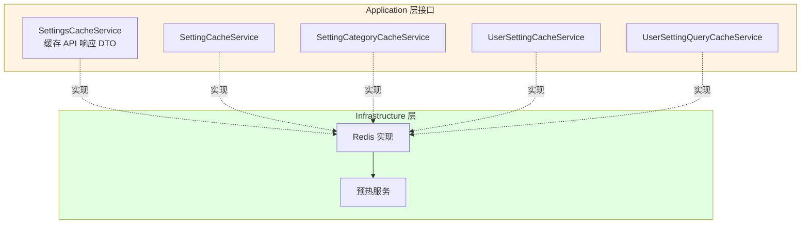
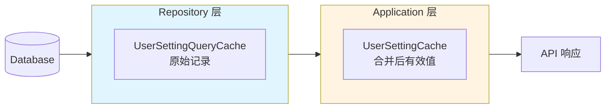
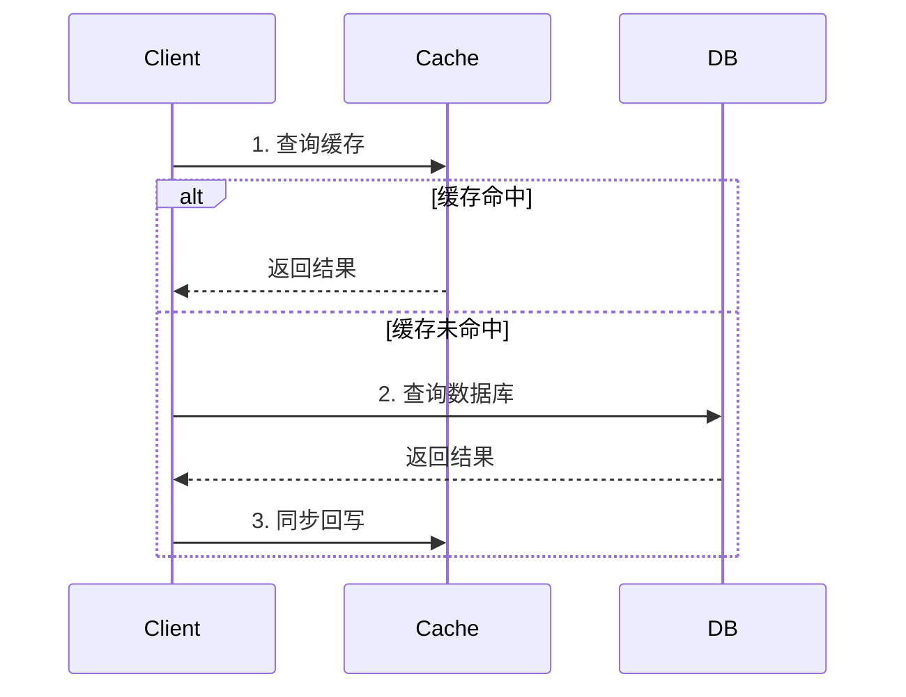
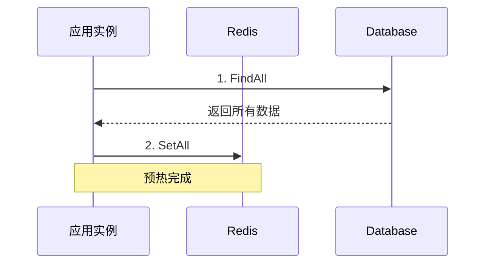
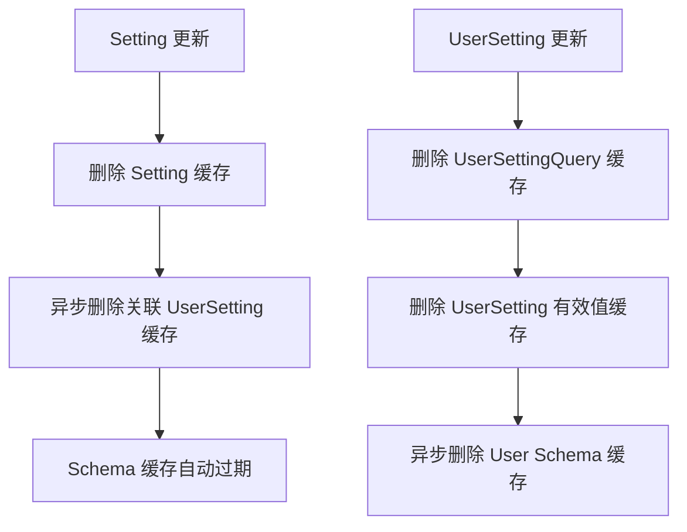

# Setting 缓存架构

Setting 模块采用**三层分布式缓存架构**，遵循 DDD 依赖倒置原则，实现了高效的多层缓存系统。

<!--TOC-->

## Table of Contents

- [架构概览](#架构概览) `:29+41`
  - [三层架构设计](#三层架构设计) `:31+30`
  - [各层职责](#各层职责) `:61+9`
- [缓存类型](#缓存类型) `:70+82`
  - [Setting 实体缓存](#setting-实体缓存) `:72+23`
  - [SettingCategory 缓存](#settingcategory-缓存) `:95+12`
  - [UserSetting 缓存](#usersetting-缓存) `:107+32`
  - [Schema 缓存](#schema-缓存) `:139+13`
- [缓存策略](#缓存策略) `:152+79`
  - [Cache-Aside 模式](#cache-aside-模式) `:154+26`
  - [预热机制](#预热机制) `:180+30`
  - [失效策略](#失效策略) `:210+21`
- [装饰器模式](#装饰器模式) `:231+45`
  - [Repository 装饰器](#repository-装饰器) `:233+29`
  - [初始化流程](#初始化流程) `:262+14`
- [Key 命名规范](#key-命名规范) `:276+22`
- [调试命令](#调试命令) `:298+27`

<!--TOC-->

## 架构概览

### 三层架构设计



**依赖方向**: `Application → Infrastructure`

### 各层职责

| 层                 | 位置                    | 缓存接口               | 缓存内容              |
| ------------------ | ----------------------- | ---------------------- | --------------------- |
| **Application**    | `application/setting/`  | SettingCacheService 等 | Domain 实体 + App DTO |
| **Infrastructure** | `infrastructure/cache/` | Redis 实现 + 预热服务  | -                     |

> **架构原则**：所有缓存接口统一定义在 Application 层，Domain 层不定义缓存接口。

## 缓存类型

### Setting 实体缓存

系统设置定义缓存，支持启动预热和按 Key 查询。

| 属性     | 值                      |
| -------- | ----------------------- |
| 接口     | `SettingCacheService`   |
| Key 格式 | `{prefix}setting:{key}` |
| TTL      | 7 天                    |
| 预热     | ✅ 启动时自动预热       |

**核心方法：**

```go
// 单条操作
Get(ctx, key) → *setting.Setting
Set(ctx, *setting.Setting)

// 批量操作（用于预热）
GetAll(ctx) → map[string]*setting.Setting
SetAll(ctx, settings)
```

### SettingCategory 缓存

设置分类缓存，支持双索引（ID 和 Key）。

| 属性     | 值                                   |
| -------- | ------------------------------------ |
| 接口     | `SettingCategoryCacheService`        |
| Key 格式 | `{prefix}setting_category:id:{id}`   |
|          | `{prefix}setting_category:key:{key}` |
| TTL      | 7 天                                 |
| 预热     | ✅ 启动时自动预热                    |

### UserSetting 缓存

用户设置采用**二层缓存**设计：



| 缓存服务                     | 存储内容         | Key 格式                           | TTL     |
| ---------------------------- | ---------------- | ---------------------------------- | ------- |
| UserSettingQueryCacheService | 原始 UserSetting | `{prefix}usersetting:user:{uid}`   | 30 分钟 |
| UserSettingCacheService      | 合并后的有效值   | `{prefix}user:{uid}:setting:{key}` | 30 分钟 |

**为什么分层？**

- **Repository 层**：需要原始 `UserSetting` 记录，与 `Setting` 合并计算有效值
- **Application 层**：直接使用已合并的 `EffectiveUserSetting`，包含 UI 元数据

### Schema 缓存

缓存 API 响应（`SchemaCategoryDTO`），避免重复构建。

| 属性     | 值                                           |
| -------- | -------------------------------------------- |
| 接口     | `SchemaCacheService`                         |
| Key 格式 | `{prefix}schema:admin:{categoryKey}`         |
|          | `{prefix}schema:user:{userID}:{categoryKey}` |
| TTL      | 30 分钟                                      |

**特点：** 直接序列化 Application DTO，无独立缓存 DTO。

## 缓存策略

### Cache-Aside 模式

所有缓存装饰器采用 Cache-Aside 模式：



**关键特性：**

- 缓存未命中不返回错误，fallback 到数据库
- 同步回写（延迟可忽略 < 1ms）
- 损坏缓存自动清除

### 预热机制

应用启动时预热 Setting 和 SettingCategory 缓存。



**设计简化：**

- **无分布式锁**：多实例同时预热是幂等操作，数据量小，重复写入可接受
- **无预热标记**：每次启动都执行预热，确保缓存数据最新

**为什么这样设计？**

| 方案         | 优点             | 缺点                               |
| ------------ | ---------------- | ---------------------------------- |
| 分布式锁     | 避免重复写入     | 代码复杂，锁 TTL 管理困难          |
| **直接预热** | 代码简单，幂等性 | 多实例重复写入（数据量小时可忽略） |

**失败降级：** 预热失败不阻塞启动，降级为 Cache-Aside 模式的惰性加载。

### 失效策略

写操作后同步删除缓存，并级联失效派生层。



**为什么同步删除？**

- Redis 删除延迟可忽略
- 避免竞态条件，无需版本控制
- 代码简单，调试容易

## 装饰器模式

### Repository 装饰器

| 装饰器                                   | 装饰目标          | 缓存层                       |
| ---------------------------------------- | ----------------- | ---------------------------- |
| `setting_cached_query_repository`        | Setting Query     | SettingCacheService          |
| `setting_cached_command_repository`      | Setting Command   | + 级联 UserSetting           |
| `setting_category_cached_query_repo`     | Category Query    | SettingCategoryCacheService  |
| `user_setting_cached_query_repository`   | UserSetting Query | UserSettingQueryCacheService |
| `user_setting_cached_command_repository` | UserSetting Cmd   | 多层缓存失效                 |

**装饰器结构：**

```go
type cachedSettingQueryRepository struct {
    delegate setting.QueryRepository   // 被装饰的原始仓储
    cache    cache.SettingCacheService // 缓存服务
}

func NewCachedSettingQueryRepository(
    delegate setting.QueryRepository,
    cacheService cache.SettingCacheService,
) setting.QueryRepository {
    return &cachedSettingQueryRepository{
        delegate: delegate,
        cache:    cacheService,
    }
}
```

### 初始化流程

```
Container 初始化顺序：
1. Infrastructure (DB, Redis)
2. Cache Services Module ⬅️ 创建所有缓存服务
3. Repositories Module   ⬅️ 使用缓存服务装饰仓储
4. Cache Warmup          ⬅️ 预热 Setting/Category 缓存
5. HTTP Handlers
6. Router
```

**入口文件：** `internal/bootstrap/init_cache.go`

## Key 命名规范

**环境前缀**（由 `config.Data.RedisKeyPrefix` 配置）：

| 环境     | 默认前缀 | 示例                     |
| -------- | -------- | ------------------------ |
| 开发环境 | `dev:`   | `dev:setting:site_name`  |
| 生产环境 | 按需配置 | `prod:setting:site_name` |

**各类型 Key 格式：**

| 缓存类型           | Key 格式                              |
| ------------------ | ------------------------------------- |
| Setting 实体       | `{prefix}setting:{key}`               |
| Category (ID)      | `{prefix}setting_category:id:{id}`    |
| Category (Key)     | `{prefix}setting_category:key:{key}`  |
| Category (All)     | `{prefix}setting_category:all`        |
| UserSetting 原始   | `{prefix}usersetting:user:{userID}`   |
| UserSetting 有效值 | `{prefix}user:{userID}:setting:{key}` |
| Admin Schema       | `{prefix}schema:admin:{categoryKey}`  |
| User Schema        | `{prefix}schema:user:{uid}:{catKey}`  |

## 调试命令

```bash
# 查看所有缓存 key
redis-cli -u $REDIS_URL KEYS 'dev:*'

# 查看 Setting 缓存
redis-cli -u $REDIS_URL JSON.GET 'dev:setting:site_name' '$'

# 查看 Schema 缓存
redis-cli -u $REDIS_URL JSON.GET 'dev:schema:admin:general' '$'

# 清空开发环境缓存
redis-cli -u $REDIS_URL KEYS 'dev:*' | xargs -r redis-cli -u $REDIS_URL DEL
```

**文件位置速查：**

| 类型             | 位置                                    |
| ---------------- | --------------------------------------- |
| Setting 缓存接口 | `internal/application/setting/cache.go` |
| Auth 缓存接口    | `internal/application/auth/cache.go`    |
| User 缓存接口    | `internal/application/user/cache.go`    |
| Redis 实现       | `internal/infrastructure/cache/`        |
| 预热服务         | `internal/infrastructure/cache/warmup/` |
| 装饰器           | `internal/infrastructure/persistence/`  |
| Container        | `internal/container/cache.go`           |
