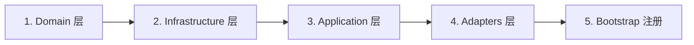

# 添加新功能

本文档介绍如何在项目中添加新功能，遵循 DDD + CQRS 架构。

<!--TOC-->

## Table of Contents

- [开发流程](#开发流程) `:22+10`
- [完整示例：通知功能](#完整示例通知功能) `:32+565`
  - [第一步：Domain 层定义](#第一步domain-层定义) `:36+86`
  - [第二步：Infrastructure 层实现](#第二步infrastructure-层实现) `:122+179`
  - [第三步：Application 层创建 Use Cases](#第三步application-层创建-use-cases) `:301+164`
  - [第四步：Adapters 层创建 HTTP Handler](#第四步adapters-层创建-http-handler) `:465+83`
  - [第五步：Bootstrap 注册依赖](#第五步bootstrap-注册依赖) `:548+37`
  - [第六步：添加路由](#第六步添加路由) `:585+12`
- [检查清单](#检查清单) `:597+43`
- [相关文档](#相关文档) `:640+5`

<!--TOC-->

## 开发流程



## 完整示例：通知功能

下面通过实现一个 **通知/消息推送** 功能来演示：

### 第一步：Domain 层定义

#### 1.1 定义实体

```go
// internal/domain/notification/entity_notification.go
package notification

import "time"

// Notification 通知实体
type Notification struct {
    ID        uint
    UserID    uint
    Title     string
    Content   string
    Type      string    // info, warning, error
    IsRead    bool
    CreatedAt time.Time
    ReadAt    *time.Time
}

// MarkAsRead 标记已读
func (n *Notification) MarkAsRead() {
    if !n.IsRead {
        n.IsRead = true
        now := time.Now()
        n.ReadAt = &now
    }
}

// IsUnread 检查是否未读
func (n *Notification) IsUnread() bool {
    return !n.IsRead
}
```

#### 1.2 定义 Command Repository 接口

```go
// internal/domain/notification/command_repository.go
package notification

import "context"

// CommandRepository 写操作仓储接口
type CommandRepository interface {
    Create(ctx context.Context, notification *Notification) error
    Update(ctx context.Context, notification *Notification) error
    Delete(ctx context.Context, id uint) error
    MarkAsRead(ctx context.Context, id uint) error
    MarkAllAsRead(ctx context.Context, userID uint) error
}
```

#### 1.3 定义 Query Repository 接口

```go
// internal/domain/notification/query_repository.go
package notification

import "context"

// QueryRepository 读操作仓储接口
type QueryRepository interface {
    GetByID(ctx context.Context, id uint) (*Notification, error)
    ListByUserID(ctx context.Context, userID uint, offset, limit int) ([]*Notification, int64, error)
    CountUnread(ctx context.Context, userID uint) (int64, error)
    ExistsByID(ctx context.Context, id uint) (bool, error)
}
```

#### 1.4 定义领域错误

```go
// internal/domain/notification/errors.go
package notification

import "errors"

var (
    ErrNotificationNotFound = errors.New("notification not found")
    ErrNotificationAlreadyRead = errors.New("notification already read")
)
```

### 第二步：Infrastructure 层实现

#### 2.1 创建 GORM 模型

```go
// internal/infrastructure/persistence/notification_model.go
package persistence

import (
    "time"
    "your-project/internal/domain/notification"
)

// NotificationModel GORM 模型
type NotificationModel struct {
    ID        uint       `gorm:"primaryKey"`
    UserID    uint       `gorm:"index;not null"`
    Title     string     `gorm:"size:200;not null"`
    Content   string     `gorm:"type:text"`
    Type      string     `gorm:"size:20;default:'info'"`
    IsRead    bool       `gorm:"default:false"`
    CreatedAt time.Time  `gorm:"autoCreateTime"`
    ReadAt    *time.Time
}

func (NotificationModel) TableName() string {
    return "notifications"
}

// newNotificationModelFromEntity 将实体转换为模型
func newNotificationModelFromEntity(entity *notification.Notification) *NotificationModel {
    return &NotificationModel{
        ID:        entity.ID,
        UserID:    entity.UserID,
        Title:     entity.Title,
        Content:   entity.Content,
        Type:      entity.Type,
        IsRead:    entity.IsRead,
        CreatedAt: entity.CreatedAt,
        ReadAt:    entity.ReadAt,
    }
}

// toEntity 将模型转换为实体
func (m *NotificationModel) toEntity() *notification.Notification {
    return &notification.Notification{
        ID:        m.ID,
        UserID:    m.UserID,
        Title:     m.Title,
        Content:   m.Content,
        Type:      m.Type,
        IsRead:    m.IsRead,
        CreatedAt: m.CreatedAt,
        ReadAt:    m.ReadAt,
    }
}
```

#### 2.2 实现 Command Repository

```go
// internal/infrastructure/persistence/notification_command_repository.go
package persistence

import (
    "context"
    "time"

    "gorm.io/gorm"
    "your-project/internal/domain/notification"
)

type notificationCommandRepository struct {
    db *gorm.DB
}

func NewNotificationCommandRepository(db *gorm.DB) notification.CommandRepository {
    return &notificationCommandRepository{db: db}
}

func (r *notificationCommandRepository) Create(ctx context.Context, entity *notification.Notification) error {
    model := newNotificationModelFromEntity(entity)
    if err := r.db.WithContext(ctx).Create(model).Error; err != nil {
        return err
    }
    *entity = *model.toEntity()
    return nil
}

func (r *notificationCommandRepository) Update(ctx context.Context, entity *notification.Notification) error {
    model := newNotificationModelFromEntity(entity)
    return r.db.WithContext(ctx).Save(model).Error
}

func (r *notificationCommandRepository) Delete(ctx context.Context, id uint) error {
    return r.db.WithContext(ctx).Delete(&NotificationModel{}, id).Error
}

func (r *notificationCommandRepository) MarkAsRead(ctx context.Context, id uint) error {
    now := time.Now()
    return r.db.WithContext(ctx).Model(&NotificationModel{}).
        Where("id = ?", id).
        Updates(map[string]any{"is_read": true, "read_at": now}).Error
}

func (r *notificationCommandRepository) MarkAllAsRead(ctx context.Context, userID uint) error {
    now := time.Now()
    return r.db.WithContext(ctx).Model(&NotificationModel{}).
        Where("user_id = ? AND is_read = ?", userID, false).
        Updates(map[string]any{"is_read": true, "read_at": now}).Error
}
```

#### 2.3 实现 Query Repository

```go
// internal/infrastructure/persistence/notification_query_repository.go
package persistence

import (
    "context"

    "gorm.io/gorm"
    "your-project/internal/domain/notification"
)

type notificationQueryRepository struct {
    db *gorm.DB
}

func NewNotificationQueryRepository(db *gorm.DB) notification.QueryRepository {
    return &notificationQueryRepository{db: db}
}

func (r *notificationQueryRepository) GetByID(ctx context.Context, id uint) (*notification.Notification, error) {
    var model NotificationModel
    if err := r.db.WithContext(ctx).First(&model, id).Error; err != nil {
        return nil, err
    }
    return model.toEntity(), nil
}

func (r *notificationQueryRepository) ListByUserID(ctx context.Context, userID uint, offset, limit int) ([]*notification.Notification, int64, error) {
    var models []NotificationModel
    var total int64

    query := r.db.WithContext(ctx).Model(&NotificationModel{}).Where("user_id = ?", userID)

    if err := query.Count(&total).Error; err != nil {
        return nil, 0, err
    }

    if err := query.Order("created_at DESC").Offset(offset).Limit(limit).Find(&models).Error; err != nil {
        return nil, 0, err
    }

    entities := make([]*notification.Notification, len(models))
    for i := range models {
        entities[i] = models[i].toEntity()
    }

    return entities, total, nil
}

func (r *notificationQueryRepository) CountUnread(ctx context.Context, userID uint) (int64, error) {
    var count int64
    err := r.db.WithContext(ctx).Model(&NotificationModel{}).
        Where("user_id = ? AND is_read = ?", userID, false).
        Count(&count).Error
    return count, err
}

func (r *notificationQueryRepository) ExistsByID(ctx context.Context, id uint) (bool, error) {
    var count int64
    err := r.db.WithContext(ctx).Model(&NotificationModel{}).Where("id = ?", id).Count(&count).Error
    return count > 0, err
}
```

### 第三步：Application 层创建 Use Cases

#### 3.1 创建 Command

```go
// internal/application/notification/command/create_notification.go
package command

// CreateNotificationCommand 创建通知命令
type CreateNotificationCommand struct {
    UserID  uint
    Title   string
    Content string
    Type    string
}

// CreateNotificationResult 创建结果
type CreateNotificationResult struct {
    NotificationID uint
}
```

```go
// internal/application/notification/command/create_notification_handler.go
package command

import (
    "context"
    "your-project/internal/domain/notification"
)

type CreateNotificationHandler struct {
    notificationCommandRepo notification.CommandRepository
}

func NewCreateNotificationHandler(repo notification.CommandRepository) *CreateNotificationHandler {
    return &CreateNotificationHandler{notificationCommandRepo: repo}
}

func (h *CreateNotificationHandler) Handle(ctx context.Context, cmd CreateNotificationCommand) (*CreateNotificationResult, error) {
    entity := &notification.Notification{
        UserID:  cmd.UserID,
        Title:   cmd.Title,
        Content: cmd.Content,
        Type:    cmd.Type,
    }

    if err := h.notificationCommandRepo.Create(ctx, entity); err != nil {
        return nil, err
    }

    return &CreateNotificationResult{NotificationID: entity.ID}, nil
}
```

#### 3.2 创建 Query

```go
// internal/application/notification/query/list_notifications.go
package query

// ListNotificationsQuery 列表查询
type ListNotificationsQuery struct {
    UserID uint
    Page   int
    Limit  int
}
```

```go
// internal/application/notification/query/list_notifications_handler.go
package query

import (
    "context"
    "your-project/internal/application/notification"
    domainNotification "your-project/internal/domain/notification"
)

type ListNotificationsHandler struct {
    notificationQueryRepo domainNotification.QueryRepository
}

func NewListNotificationsHandler(repo domainNotification.QueryRepository) *ListNotificationsHandler {
    return &ListNotificationsHandler{notificationQueryRepo: repo}
}

func (h *ListNotificationsHandler) Handle(ctx context.Context, query ListNotificationsQuery) (*notification.ListNotificationsResponse, error) {
    offset := (query.Page - 1) * query.Limit

    entities, total, err := h.notificationQueryRepo.ListByUserID(ctx, query.UserID, offset, query.Limit)
    if err != nil {
        return nil, err
    }

    return &notification.ListNotificationsResponse{
        Notifications: notification.ToNotificationResponses(entities),
        Total:         total,
    }, nil
}
```

#### 3.3 定义 DTO 和 Mapper

```go
// internal/application/notification/dto.go
package notification

import "time"

// CreateNotificationDTO 创建请求
type CreateNotificationDTO struct {
    Title   string `json:"title" binding:"required,min=1,max=200"`
    Content string `json:"content"`
    Type    string `json:"type" binding:"omitempty,oneof=info warning error"`
}

// NotificationResponse 响应
type NotificationResponse struct {
    ID        uint       `json:"id"`
    Title     string     `json:"title"`
    Content   string     `json:"content"`
    Type      string     `json:"type"`
    IsRead    bool       `json:"is_read"`
    CreatedAt time.Time  `json:"created_at"`
    ReadAt    *time.Time `json:"read_at,omitempty"`
}

// ListNotificationsResponse 列表响应
type ListNotificationsResponse struct {
    Notifications []*NotificationResponse `json:"notifications"`
    Total         int64                   `json:"total"`
}
```

```go
// internal/application/notification/mapper.go
package notification

import "your-project/internal/domain/notification"

// ToNotificationResponse 转换为响应 DTO
func ToNotificationResponse(entity *notification.Notification) *NotificationResponse {
    return &NotificationResponse{
        ID:        entity.ID,
        Title:     entity.Title,
        Content:   entity.Content,
        Type:      entity.Type,
        IsRead:    entity.IsRead,
        CreatedAt: entity.CreatedAt,
        ReadAt:    entity.ReadAt,
    }
}

// ToNotificationResponses 批量转换
func ToNotificationResponses(entities []*notification.Notification) []*NotificationResponse {
    responses := make([]*NotificationResponse, len(entities))
    for i, entity := range entities {
        responses[i] = ToNotificationResponse(entity)
    }
    return responses
}
```

### 第四步：Adapters 层创建 HTTP Handler

```go
// internal/adapters/http/handler/notification.go
package handler

import (
    "strconv"

    "github.com/gin-gonic/gin"
    "your-project/internal/adapters/http/response"
    notificationDTO "your-project/internal/application/notification"
    notificationCommand "your-project/internal/application/notification/command"
    notificationQuery "your-project/internal/application/notification/query"
)

type NotificationHandler struct {
    createNotificationHandler *notificationCommand.CreateNotificationHandler
    listNotificationsHandler  *notificationQuery.ListNotificationsHandler
    markAsReadHandler         *notificationCommand.MarkAsReadHandler
}

func NewNotificationHandler(
    createHandler *notificationCommand.CreateNotificationHandler,
    listHandler *notificationQuery.ListNotificationsHandler,
    markAsReadHandler *notificationCommand.MarkAsReadHandler,
) *NotificationHandler {
    return &NotificationHandler{
        createNotificationHandler: createHandler,
        listNotificationsHandler:  listHandler,
        markAsReadHandler:         markAsReadHandler,
    }
}

// Create 创建通知
func (h *NotificationHandler) Create(c *gin.Context) {
    var req notificationDTO.CreateNotificationDTO
    if err := c.ShouldBindJSON(&req); err != nil {
        response.ValidationError(c, err.Error())
        return
    }

    userID := c.GetUint("user_id")

    result, err := h.createNotificationHandler.Handle(c.Request.Context(),
        notificationCommand.CreateNotificationCommand{
            UserID:  userID,
            Title:   req.Title,
            Content: req.Content,
            Type:    req.Type,
        })

    if err != nil {
        response.InternalError(c, err.Error())
        return
    }

    response.Created(c, "notification created", result)
}

// List 获取通知列表
func (h *NotificationHandler) List(c *gin.Context) {
    userID := c.GetUint("user_id")
    page, _ := strconv.Atoi(c.DefaultQuery("page", "1"))
    limit, _ := strconv.Atoi(c.DefaultQuery("limit", "20"))

    result, err := h.listNotificationsHandler.Handle(c.Request.Context(),
        notificationQuery.ListNotificationsQuery{
            UserID: userID,
            Page:   page,
            Limit:  limit,
        })

    if err != nil {
        response.InternalError(c, err.Error())
        return
    }

    meta := response.NewPaginationMeta(int(result.Total), page, limit)
    response.List(c, "success", result.Notifications, meta)
}
```

### 第五步：Bootstrap 注册依赖

```go
// internal/bootstrap/container.go
// 在 Container 结构体中添加字段

// Notification Repositories
NotificationCommandRepo notification.CommandRepository
NotificationQueryRepo   notification.QueryRepository

// Notification Use Case Handlers
CreateNotificationHandler *notificationCommand.CreateNotificationHandler
ListNotificationsHandler  *notificationQuery.ListNotificationsHandler

// Notification HTTP Handler
NotificationHandler *handler.NotificationHandler
```

```go
// 在 NewContainer 方法中初始化

// 1. 创建 Repositories
c.NotificationCommandRepo = persistence.NewNotificationCommandRepository(db)
c.NotificationQueryRepo = persistence.NewNotificationQueryRepository(db)

// 2. 创建 Use Case Handlers
c.CreateNotificationHandler = notificationCommand.NewCreateNotificationHandler(c.NotificationCommandRepo)
c.ListNotificationsHandler = notificationQuery.NewListNotificationsHandler(c.NotificationQueryRepo)

// 3. 创建 HTTP Handler
c.NotificationHandler = handler.NewNotificationHandler(
    c.CreateNotificationHandler,
    c.ListNotificationsHandler,
    c.MarkAsReadHandler,
)
```

### 第六步：添加路由

```go
// internal/adapters/http/router.go
// 在路由设置中添加新路由

// 通知相关路由
userGroup.POST("/notifications", notificationHandler.Create)
userGroup.GET("/notifications", notificationHandler.List)
userGroup.PATCH("/notifications/:id/read", notificationHandler.MarkAsRead)
```

## 检查清单

添加新功能时请确保完成以下步骤：

- [ ] Domain 层
  - [ ] 定义实体 (`entity_xxx.go`)
  - [ ] 定义 Command Repository 接口
  - [ ] 定义 Query Repository 接口
  - [ ] 定义领域错误

- [ ] Infrastructure 层
  - [ ] 创建 GORM 模型 (`xxx_model.go`)
  - [ ] 实现 Command Repository
  - [ ] 实现 Query Repository
  - [ ] 添加数据库迁移

- [ ] Application 层
  - [ ] 创建 Command + Handler
  - [ ] 创建 Query + Handler
  - [ ] 定义 DTO
  - [ ] 定义 Mapper

- [ ] Adapters 层
  - [ ] 创建 HTTP Handler
  - [ ] 添加 Swagger 注解

- [ ] Bootstrap
  - [ ] 注册 Repositories
  - [ ] 注册 Use Case Handlers
  - [ ] 注册 HTTP Handler

- [ ] 路由
  - [ ] 在 router.go 中添加新路由
  - [ ] 确保权限控制正确

- [ ] 测试
  - [ ] 编写单元测试
  - [ ] 编写集成测试

- [ ] 文档
  - [ ] 更新 API 文档
  - [ ] 更新架构文档（如需要）

## 相关文档

- [测试指南](/development/testing)
- [错误处理](/development/error-handling)
- [代码规范](/development/code-style)
