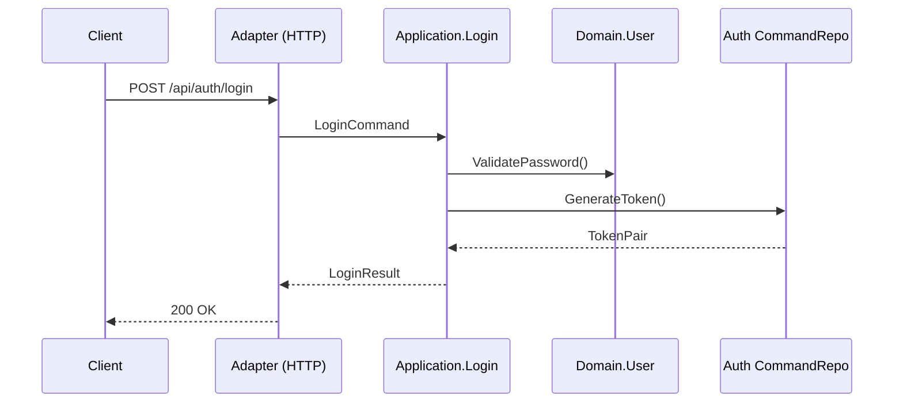

# 文档功能示例

本页示范如何使用仓库内置的 Vue 组件与 Markdown 模式来描绘 Go DDD Template 的能力。所有组件均定义于 `docs/.vitepress/theme/components/`，可以在任何 Markdown 页面中直接引用。

## ApiEndpoint 组件

用于描述 `internal/adapters/http` 暴露的接口，便于和 API 文档保持一致。

<ApiEndpoint
  method="POST"
  path="/api/auth/login"
  description="用户登录 (对应 internal/application/auth/command/login_handler.go)">

**请求体**

```json
{
  "username": "admin",
  "password": "changeme"
}
```

**响应示例**

```json
{
  "access_token": "<jwt>",
  "refresh_token": "<jwt>",
  "expires_in": 3600
}
```

</ApiEndpoint>

<ApiEndpoint
  method="PUT"
  path="/api/admin/users/:id/roles"
  version="v1"
  description="角色分配 (调用 internal/application/user/command/assign_roles_handler.go)">

- `id`：用户 ID
- body：`{"role_ids": [1,2,3]}`
- 需要 `RequireRole("admin")`

</ApiEndpoint>

## FeatureCard 组件

快速总结 DDD + CQRS 实现的关键特性。

<FeatureCard
  title="富领域模型"
  description="User、Role 等实体封装业务行为"
  icon="🧠">

- `internal/domain/user/entity_user.go`
- 领域方法：`Activate()`、`AssignRole()`
- 所有状态变更经由 Application 层 orchestrator

</FeatureCard>

<FeatureCard
  title="CQRS Repository"
  description="读写分离的仓储接口"
  icon="📚"
  highlighted>

- 接口文件：`internal/domain/user/command_repository.go`、`query_repository.go`
- 实现：`internal/infrastructure/persistence/user_command_repository.go`
- Query 层可独立扩展 Redis/ES

</FeatureCard>

## StepsGuide 组件

适合描述开发流程或任务自动化。数据可直接在 Markdown 中以 `<script setup>` 定义：

```vue
<script setup>
const steps = [
  { title: "准备依赖", description: "npm --prefix docs install && go mod download" },
  { title: "运行服务", description: "task go:run -- api" },
  { title: "构建文档", description: "npm --prefix docs run build" },
  { title: "发布", description: "git push && 等待 GitHub Actions" },
];
</script>

<StepsGuide :steps="steps" />
```

## Markdown 模式

### 任务列表同步开发节奏

- [x] 完成 CQRS repository
- [x] 合并 docs 与 Go API 的部署
- [ ] 为新的领域服务补充文档

### 代码块文件名

```go [internal/domain/user/command_repository.go]
type CommandRepository interface {
    Create(ctx context.Context, user *User) error
    Update(ctx context.Context, user *User) error
    Delete(ctx context.Context, id uint) error
}
```

### 容器样式

::: tip 架构校验
提交前需确保 `docs/backend/*` 与真实代码保持一致，禁止出现旧的三层描述。
:::

## 组合示例

下方示例把 ApiEndpoint、FeatureCard 与 Mermaid 组合在同一页面，展示一次完整的登录流程。

<ApiEndpoint
  method="POST"
  path="/api/auth/login"
  description="登录流程"
  version="v2">



</ApiEndpoint>

利用这些组件可以快速构建面向 DDD 架构的开发文档，而无需额外的 Markdown 插件或构建流程。
