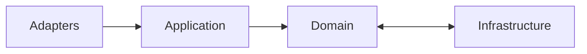
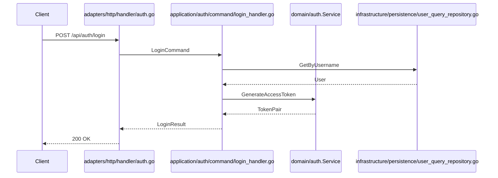

# Mermaid 集成说明

Mermaid 用于在文档中快速展示 DDD 分层、CQRS 流程、认证链路等结构图。本页记录其在本仓库中的接入方式与最佳实践。

## 集成概览

| 位置                                           | 作用                                                  |
| ---------------------------------------------- | ----------------------------------------------------- |
| `docs/.vitepress/config.ts`                    | 拦截 ` ```mermaid ` 代码块，渲染为 `<Mermaid>` 组件。 |
| `docs/.vitepress/theme/components/Mermaid.vue` | 调用 `mermaid.render()`，处理暗色/亮色主题切换。      |
| `docs/package.json`                            | 声明 `mermaid ^11.12.1` 依赖。                        |
| `docs/backend/ddd-cqrs.md`                     | 实际使用 Mermaid 描述 DDD/CQRS 架构的示例页面。        |

## Markdown 渲染器

`config.ts` 中通过 `markdown.config` 重写 `fence` 行为：

```ts
markdown: {
  config: (md) => {
    const fence = md.renderer.rules.fence!;
    md.renderer.rules.fence = (...args) => {
      const [tokens, idx] = args;
      if (tokens[idx].info.trim() === "mermaid") {
        const code = md.utils.escapeHtml(tokens[idx].content.trim());
        return `<Mermaid><pre style="display:none;">${code}</pre></Mermaid>`;
      }
      return fence(...args);
    };
  },
},
```

这样可在 Markdown 中持续使用标准的代码块语法：

````markdown

````

## Vue 组件行为

`Mermaid.vue` 会：

1. 读取 slot 内的 `<pre>`，恢复为原始 Mermaid 字符串。
2. 根据主题 (`useData().isDark`) 切换 `theme: 'dark' | 'default'`。
3. 在路由更新时重新渲染，确保切换页面后图表依旧存在。

## 示例：CQRS 流程

```mermaid
graph TD
    UI[HTTP Handler (Adapters)] -->|Command| UC[Application Use Case]
    UC -->|写操作| CR[CommandRepository]
    UC -->|读操作| QR[QueryRepository]
    CR --> DB[(PostgreSQL)]
    QR --> Cache[(Redis)]
```

## 示例：认证管线



## 调试技巧

- **语法校验**：使用 [mermaid.live](https://mermaid.live/) 预览后再粘贴到 Markdown。
- **主题切换**：若暗色模式渲染异常，检查浏览器控制台是否有 `mermaid` 错误。
- **大图滚动**：Mermaid 输出的 `<svg>` 默认可滚动，必要时可在 Markdown 中包裹 `<div style="overflow:auto">`。

## 性能注意事项

- 避免在同一页渲染过多复杂图表（>10 个），否则会阻塞首屏渲染。
- 对于只需要静态图片的场景，可以通过 `` 插入截图，降低运行时成本。

## 清理规则

- 若某页图表描述的模块已删除（例如旧的三层架构），需要同步更新或移除相应的 Mermaid 图。
- 所有示例必须能在 `npm --prefix docs run build` 中顺利渲染，CI 若提示 `mermaid` 错误，请先在本地复现并修复语法。
