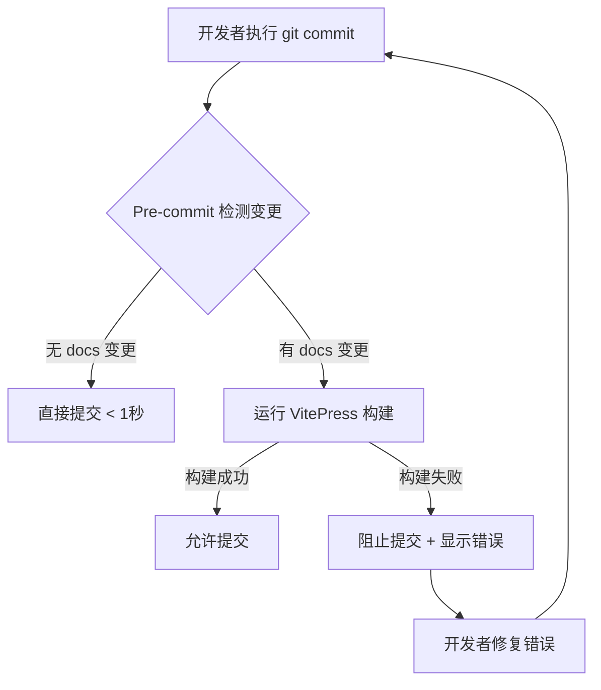

# Pre-commit 代码质量检查

本项目使用 [pre-commit](https://pre-commit.com/) 框架在 Git 提交前自动执行代码质量检查，确保文档构建成功。

## 设计理念

### 为什么需要 Pre-commit？

在团队协作中，文档的准确性和一致性至关重要。Pre-commit 框架帮助我们：

- ✅ **即时反馈**：在提交代码前立即发现问题，而不是在 CI/CD 阶段
- ✅ **自动化保障**：无需手动运行检查命令，减少人为疏忽
- ✅ **文档质量**：确保文档修改不会导致构建失败
- ✅ **开发体验**：问题在本地解决，避免反复推送修复

### 架构设计



### 工作流程

```
┌─────────────────────────────────────────────────────────┐
│ Pre-commit Hook 执行流程                                │
└─────────────────────────────────────────────────────────┘

1. 开发者修改文档
   $ vim docs/api/authentication.md

2. 暂存文件
   $ git add docs/api/authentication.md

3. 提交触发 Pre-commit
   $ git commit -m "docs: update auth API"

4. Pre-commit 框架启动
   ├─ 读取 .pre-commit-config.yaml
   ├─ 检测到 docs/ 已暂存变更
   └─ 调用 scripts/hooks/docs-build-pre-commit.sh

5. 构建脚本执行
   ├─ 检查 Node.js 依赖
   ├─ 运行 VitePress 构建
   └─ 返回构建结果

6. 根据结果决定
   ├─ 成功 → 提交继续
   └─ 失败 → 阻止提交 + 显示错误信息
```

## 快速开始

### 安装

```bash
# 1. 安装 pre-commit 工具
pip install pre-commit

# 2. 在项目中激活 Git hooks
pre-commit install

# 完成！后续 commit 会自动检查
```

### 验证安装

```bash
# 修改一个文档文件测试
echo "# Test" >> docs/test.md
git add docs/test.md
git commit -m "test: verify pre-commit"

# 应该看到 pre-commit 运行并检查文档
```

## 配置详解

### 配置文件结构

项目根目录的 `.pre-commit-config.yaml`：

```yaml
repos:
  - repo: local
    hooks:
      - id: docs-build
        name: Build VitePress docs when docs/ changes
        entry: scripts/hooks/docs-build-pre-commit.sh
        language: script
        pass_filenames: true
        stages: [pre-commit]
        files: ^docs/
```

**关键配置说明**：

| 配置项 | 说明 |
|--------|------|
| `repo: local` | 使用本地脚本，而非远程仓库 |
| `entry: scripts/...` | 要执行的脚本路径 |
| `language: script` | 脚本类型（支持 Python、Node、Go 等） |
| `pass_filenames: true` | 将变更的文件列表传递给脚本 |
| `stages: [pre-commit]` | 在 git commit 阶段执行 |
| `files: ^docs/` | 正则匹配：只检查 docs/ 下的文件 |

### 构建脚本逻辑

`scripts/hooks/docs-build-pre-commit.sh` 核心逻辑：

```bash
# 1. 检测是否有文档变更
if [ "$#" -gt 0 ]; then
    DOCS_CHANGED_FILES="$*"  # Pre-commit 传递的文件列表
else
    DOCS_CHANGED_FILES="$(git diff --cached --name-only -- 'docs/**')"
fi

# 2. 无变更则跳过
if [ -z "$DOCS_CHANGED_FILES" ]; then
    echo "No staged docs changes detected; skipping docs build."
    exit 0
fi

# 3. 检查依赖
if [ ! -d "docs/node_modules" ]; then
    echo "Installing docs dependencies..."
    (cd docs && npm install)
fi

# 4. 执行构建
if (cd docs && npm run build); then
    echo "Docs build succeeded."
    exit 0
else
    echo "Docs build failed."
    exit 1  # 非零退出码 = 阻止提交
fi
```

## 使用指南

### 正常工作流

```bash
# 修改文档
vim docs/guide/getting-started.md

# 添加到暂存区
git add docs/guide/getting-started.md

# 提交（Pre-commit 自动运行）
git commit -m "docs: improve getting started guide"

# 输出示例：
# Running docs build pre-commit hook...
# --------------------------------------
# Building docs...
# ✓ building client + server bundles...
# ✓ rendering pages...
# build complete in 15.23s.
# Docs build succeeded.
# [main abc1234] docs: improve getting started guide
```

### 构建失败处理

如果文档构建失败：

```bash
$ git commit -m "docs: update API"

Running docs build pre-commit hook...
--------------------------------------
Building docs...
build error:
Error: Invalid markdown syntax in docs/api/users.md
  at line 42: unclosed code block

Docs build failed with exit code 1.
```

**处理步骤**：

1. 查看错误信息，定位问题文件和行号
2. 修复错误（如补全代码块闭合标记）
3. 重新添加文件：`git add docs/api/users.md`
4. 再次提交

### 跳过检查

在**紧急情况**下，可以跳过 pre-commit 检查：

```bash
# 方法 1：完全跳过所有 hooks
git commit --no-verify -m "urgent fix"

# 方法 2：只跳过 docs-build
SKIP=docs-build git commit -m "docs: WIP"
```

::: warning 注意
跳过检查可能导致构建失败的文档被提交，建议只在紧急情况下使用。
:::

### 修改非文档文件

当只修改代码文件时，pre-commit 会自动跳过文档检查：

```bash
$ vim internal/domain/user/entity_user.go
$ git add internal/domain/user/entity_user.go
$ git commit -m "feat: add user validation"

Build VitePress docs when docs/ changes..........Skipped
# ↑ 无文档变更，瞬间完成
```

## 高级功能

### 更新 Hooks

Pre-commit 框架会定期更新：

```bash
# 更新所有 hooks 到最新版本
pre-commit autoupdate

# 输出示例：
# Updating https://github.com/pre-commit/pre-commit-hooks ... updating v4.5.0 -> v4.6.0.
```

### 清理缓存

如果遇到问题，可以清理 pre-commit 缓存：

```bash
# 清理所有缓存（~/.cache/pre-commit/）
pre-commit clean

# 清理未使用的环境
pre-commit gc
```

### 扩展配置

可以添加更多 hooks 来扩展功能，例如：

```yaml
repos:
  # 基础代码质量检查
  - repo: https://github.com/pre-commit/pre-commit-hooks
    rev: v4.5.0
    hooks:
      - id: trailing-whitespace  # 删除行尾空格
      - id: end-of-file-fixer    # 修复文件结尾
      - id: check-yaml           # YAML 语法检查
      - id: check-json           # JSON 语法检查

  # Go 代码格式化
  - repo: https://github.com/dnephin/pre-commit-golang
    rev: v0.5.1
    hooks:
      - id: go-fmt
      - id: go-imports

  # 本地文档构建检查
  - repo: local
    hooks:
      - id: docs-build
        # ... 现有配置
```

更多可用 hooks 请参考：https://pre-commit.com/hooks.html

## 性能优化

### 为什么有时候很慢？

VitePress 构建过程包括：

1. **客户端打包**：编译 Markdown → Vue 组件 → JavaScript 打包
2. **服务端渲染**：为每个页面生成静态 HTML
3. **资源处理**：图片优化、样式合并、文件复制

完整构建通常需要 **15-60 秒**，取决于：
- 文档数量
- 图片/资源大小
- 机器性能

### 优化策略

#### 1. 增量提交

```bash
# ✅ 推荐：小步提交
git add docs/api/auth.md
git commit -m "docs: update auth API"  # 只检查一个文件

# ❌ 避免：批量提交
git add docs/**
git commit -m "docs: update all"  # 检查所有文件，慢
```

#### 2. 利用缓存

VitePress 有内置缓存，第二次构建会更快：

```bash
# 首次构建：60 秒
$ git commit -m "docs: update"
# Docs build complete in 60.23s

# 后续构建（缓存命中）：15 秒
$ git commit -m "docs: fix typo"
# Docs build complete in 15.47s
```

#### 3. 开发时跳过检查

频繁修改文档时，可以暂时禁用检查：

```bash
# 开发阶段：快速迭代
SKIP=docs-build git commit -m "docs: WIP section 1"
SKIP=docs-build git commit -m "docs: WIP section 2"
SKIP=docs-build git commit -m "docs: WIP section 3"

# 完成后：运行一次完整检查
git commit --amend -m "docs: complete new guide"
# ↑ 这次会运行 pre-commit
```

## CI/CD 集成

在持续集成流水线中运行 pre-commit 作为最后一道防线：

### GitHub Actions

`.github/workflows/docs.yml`：

```yaml
name: Docs Quality Check

on:
  pull_request:
    paths:
      - 'docs/**'
  push:
    branches:
      - main

jobs:
  pre-commit:
    runs-on: ubuntu-latest
    steps:
      - uses: actions/checkout@v4

      - name: Set up Python
        uses: actions/setup-python@v4
        with:
          python-version: '3.11'

      - name: Install pre-commit
        run: pip install pre-commit

      - name: Run pre-commit
        run: |
          # 只检查 docs 相关的 hooks
          pre-commit run docs-build --files docs/**/*.md
```

### GitLab CI

`.gitlab-ci.yml`：

```yaml
docs-quality:
  stage: test
  image: python:3.11
  before_script:
    - pip install pre-commit
  script:
    - pre-commit run docs-build --files docs/**/*.md
  only:
    changes:
      - docs/**/*
```

## 故障排查

### 问题 1：Pre-commit 未运行

**症状**：提交时没有看到 pre-commit 输出

**解决方案**：

```bash
# 检查 hooks 是否已安装
ls -la .git/hooks/pre-commit

# 如果不存在，重新安装
pre-commit install

# 验证配置
pre-commit run --all-files
```

### 问题 2：Node 依赖未找到

**症状**：
```
docs/node_modules not found; skipping docs build.
```

**解决方案**：

```bash
# 安装文档依赖
cd docs
npm install
cd ..

# 重新提交
git commit -m "docs: update"
```

### 问题 3：构建超时

**症状**：构建运行超过 5 分钟

**解决方案**：

```bash
# 清理 VitePress 缓存
rm -rf docs/.vitepress/cache
rm -rf docs/.vitepress/dist

# 重新安装依赖
cd docs
rm -rf node_modules package-lock.json
npm install
cd ..
```

### 问题 4：Windows 路径问题

**症状**：Windows 上脚本执行失败

**解决方案**：

使用 Git Bash 或 WSL：

```bash
# 使用 Git Bash 运行
bash scripts/hooks/docs-build-pre-commit.sh

# 或在 WSL 中工作
wsl
cd /mnt/c/path/to/project
git commit -m "docs: update"
```

## 最佳实践

### ✅ 推荐做法

1. **始终启用 pre-commit**
   ```bash
   # 克隆项目后第一件事
   pip install pre-commit
   pre-commit install
   ```

2. **小步提交文档**
   - 每次只修改 1-3 个相关文档
   - 提交信息清晰描述变更

3. **本地验证后再推送**
   - Pre-commit 通过后再 push
   - 避免 CI 失败浪费时间

4. **定期更新 hooks**
   ```bash
   # 每月运行一次
   pre-commit autoupdate
   ```

### ❌ 避免做法

1. **频繁使用 `--no-verify`**
   - 绕过检查会导致低质量代码进入仓库
   - 只在紧急情况下使用

2. **提交前不测试构建**
   - 信任 pre-commit，不要手动跳过

3. **忽略构建错误**
   - 错误信息包含具体位置，仔细阅读

4. **批量修改所有文档**
   - 一次性修改 100+ 文档会导致构建缓慢
   - 分批提交

## 技术原理

### Git Hooks 机制

Git 在特定事件发生时会调用特定脚本：

```
.git/hooks/
├── pre-commit          # ← Git commit 前执行
├── pre-push            # ← Git push 前执行
├── commit-msg          # ← 编辑 commit message 后执行
└── post-commit         # ← Git commit 后执行
```

Pre-commit 框架创建了一个智能的 `.git/hooks/pre-commit` 脚本，它会：

1. 读取 `.pre-commit-config.yaml` 配置
2. 检测哪些文件被暂存
3. 根据 `files` 规则过滤文件
4. 调用对应的 hook 脚本
5. 根据退出码决定是否允许提交

### 文件过滤原理

`.pre-commit-config.yaml` 中的 `files: ^docs/` 使用正则表达式：

```python
# Pre-commit 内部逻辑（伪代码）
import re

staged_files = get_staged_files()
# ['docs/api.md', 'main.go', 'docs/guide.md']

pattern = re.compile(r'^docs/')  # 来自 files: ^docs/

filtered_files = [
    f for f in staged_files
    if pattern.match(f)
]
# 结果：['docs/api.md', 'docs/guide.md']

if filtered_files:
    run_hook(filtered_files)  # 传递给脚本
else:
    skip_hook()  # 跳过
```

### 性能优化原理

Pre-commit 框架的性能优化策略：

1. **增量检查**：只检查变更的文件
2. **环境缓存**：复用已安装的依赖
3. **并行执行**：多个 hooks 可以并行运行
4. **智能跳过**：无变更时直接跳过

## 参考资料

- [Pre-commit 官方文档](https://pre-commit.com/)
- [Pre-commit Hooks 集合](https://github.com/pre-commit/pre-commit-hooks)
- [VitePress 构建优化](https://vitepress.dev/guide/performance)
- [Git Hooks 文档](https://git-scm.com/docs/githooks)

## 总结

Pre-commit 框架为项目提供了自动化的文档质量保障：

- ✅ **自动运行**：提交时自动检查，无需手动操作
- ✅ **即时反馈**：本地发现问题，快速修复
- ✅ **文档质量**：确保文档始终可以正常构建
- ✅ **团队协作**：统一的质量标准

遵循最佳实践，pre-commit 将成为提升项目质量的有力工具。
