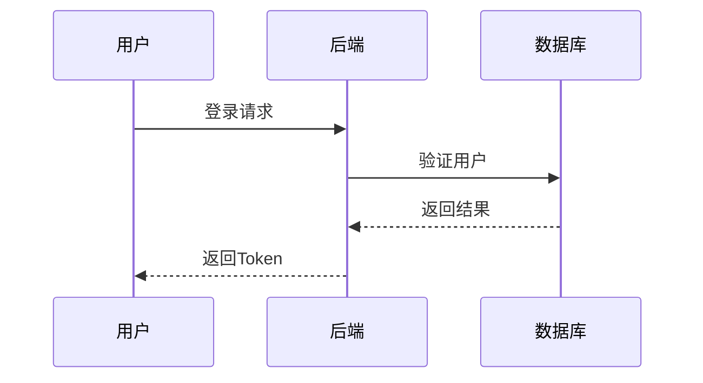
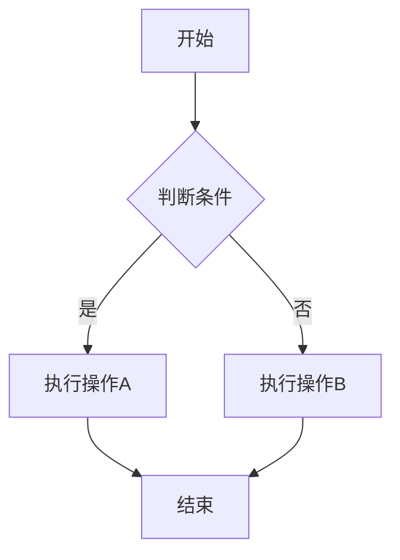

# VitePress 多环境部署 - 快速参考

## 🎯 核心概念

同一份 VitePress 代码，同一个构建命令，支持两种部署环境：

| 环境                 | base 路径             | 访问 URL                           | 构建命令             |
| -------------------- | --------------------- | ---------------------------------- | -------------------- |
| 🏠 **Go API 服务器** | `/docs/`              | `http://localhost:8080/docs/`      | `npm run docs:build` |
| 🌐 **GitHub Pages**  | `/仓库名/` (自动获取) | `https://用户名.github.io/仓库名/` | `npm run docs:build` |

**关键**: 两个环境使用相同的构建命令，base 路径通过环境变量自动配置！

## 🚀 快速开始

### 本地开发 + Go 服务器

::: code-group

```bash [使用 npm]
# 1. 构建文档
npm run docs:build

# 2. 启动 Go 服务器
task go:run -- api

# 3. 访问
open http://localhost:8080/docs/
```

```bash [使用 task]
# 1. 构建文档
task docs:build

# 2. 启动 Go 服务器
task go:run -- api

# 3. 访问
open http://localhost:8080/docs/
```

:::

### GitHub Pages (自动部署)

```bash
# 1. 修改文档
vim docs/guide/getting-started.md

# 2. 提交推送
git add docs/
git commit -m "docs: update guide"
git push

# 3. 自动部署 ✨
# GitHub Actions 自动：
# - 检测 docs/** 变更
# - 运行 npm run docs:build:github
# - 部署到 GitHub Pages
```

## 📐 架构说明

### 1. VitePress 配置 (docs/.vitepress/config.ts:12)

```typescript
base: process.env.VITEPRESS_BASE || "/docs/";
```

- 默认: `/docs/` (Go 服务器)
- 环境变量可覆盖 (GitHub Pages)

### 2. npm 脚本 (package.json)

```json
{
  "scripts": {
    "docs:build": "vitepress build docs" // ← 唯一的构建命令
  }
}
```

- 本地和 GitHub Pages 使用相同的命令
- 环境变量自动配置 base 路径

### 3. GitHub Actions 自动设置环境变量

```yaml
# .github/workflows/deploy-docs.yml:54-56
- name: Build with VitePress for GitHub Pages
  env:
    VITEPRESS_BASE: /${{ github.event.repository.name }}/ # ← 自动获取仓库名
  run: npm run docs:build
```

- GitHub Actions 自动获取仓库名
- 设置环境变量 `VITEPRESS_BASE`
- 运行相同的构建命令

### 4. Go 路由 (internal/adapters/http/router.go:71-107)

```go
docs := r.Group("/docs")
docs.GET("/*filepath", handler)
```

## ✅ 验证

### 本地构建 (Go 服务器)

```bash
npm run docs:build
grep '/docs/assets' docs/.vitepress/dist/index.html
# ✅ href="/docs/assets/style.css"
```

### 模拟 GitHub Pages 构建

```bash
VITEPRESS_BASE=/your-repo-name/ npm run docs:build
grep '/your-repo-name/assets' docs/.vitepress/dist/index.html
# ✅ href="/your-repo-name/assets/style.css"
```

**提示**: GitHub Actions 会自动使用正确的仓库名

## 🔧 启用 GitHub Pages

1. GitHub 仓库 → **Settings** → **Pages**
2. **Source**: `GitHub Actions`
3. 保存 → 完成！

## 📝 相关文件

| 文件                                      | 作用                          |
| ----------------------------------------- | ----------------------------- |
| `docs/.vitepress/config.ts:12`            | 支持环境变量 `VITEPRESS_BASE` |
| `package.json:11`                         | 统一的构建命令                |
| `.github/workflows/deploy-docs.yml:54-56` | 自动设置仓库名作为 base       |
| `internal/adapters/http/router.go:71-107` | Go 服务器 /docs 路由          |

## 🎁 优势

✅ **零硬编码**: 仓库名自动从 GitHub 获取
✅ **统一命令**: 本地和 CI 使用相同的 `npm run docs:build`
✅ **可移植**: Fork 项目后无需修改任何配置
✅ **类型安全**: `@types/node` 提供完整的类型支持

## 🎨 Mermaid 图表支持

VitePress 已集成 Mermaid 支持，可直接在 Markdown 中使用图表：

### 快速使用

::: code-group

````markdown [基础语法]

````

````markdown [时序图]

````

````markdown [流程图]

````

:::

### 支持的图表类型

- ✅ 流程图 (Flowchart)
- ✅ 时序图 (Sequence Diagram)
- ✅ 类图 (Class Diagram)
- ✅ 状态图 (State Diagram)
- ✅ ER 图、甘特图、饼图等 10+ 种

### 特性

- 自动适配亮色/暗色主题
- 标准 Markdown 代码块语法
- 无需第三方插件

**详细文档**: [Mermaid 集成说明](./mermaid-integration) | [完整示例](/guide/mermaid-examples)

## 📚 详细文档

- **完整部署指南**: `VITEPRESS_DEPLOYMENT.md`
- **文档集成说明**: `DOCS_INTEGRATION.md`
- **VitePress 2.0 升级**: `VITEPRESS_2.0_UPGRADE.md`
