# Mermaid 图表示例

本页面展示如何在 VitePress 文档中使用 Mermaid 图表。

## 流程图 (Flowchart)

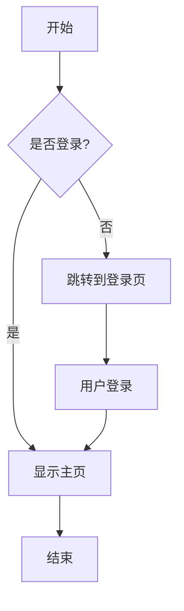

## 时序图 (Sequence Diagram)

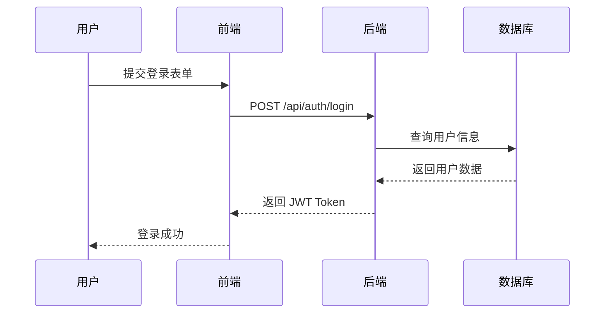

## 类图 (Class Diagram)

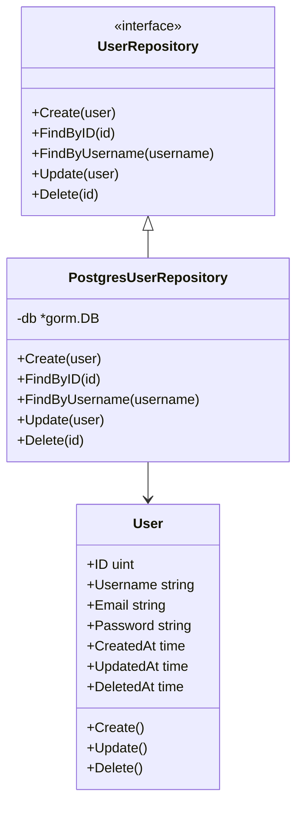

## 状态图 (State Diagram)

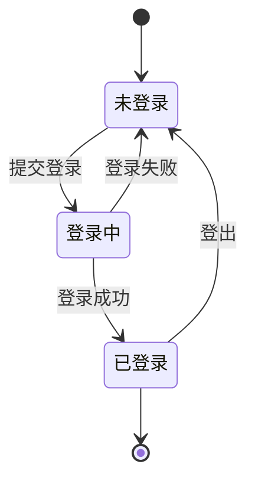

## ER 图 (Entity Relationship)

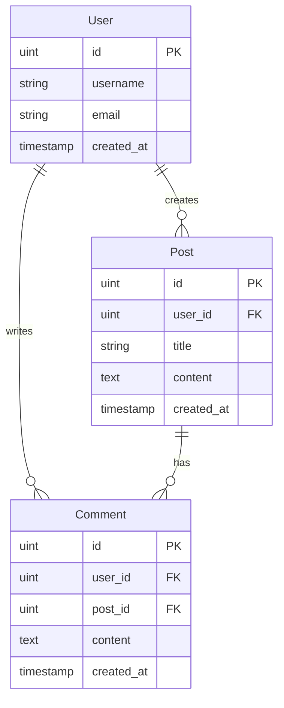

## Git 分支图 (Gitgraph)

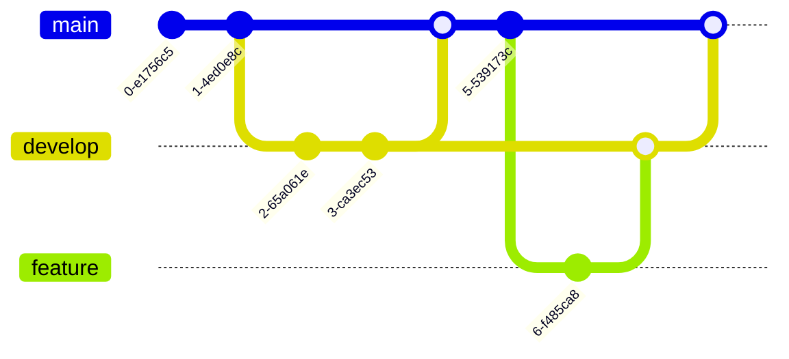

## 甘特图 (Gantt)

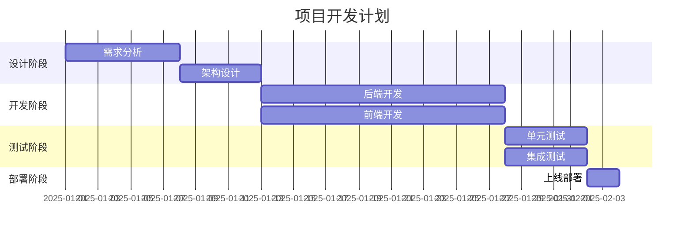

## 饼图 (Pie Chart)

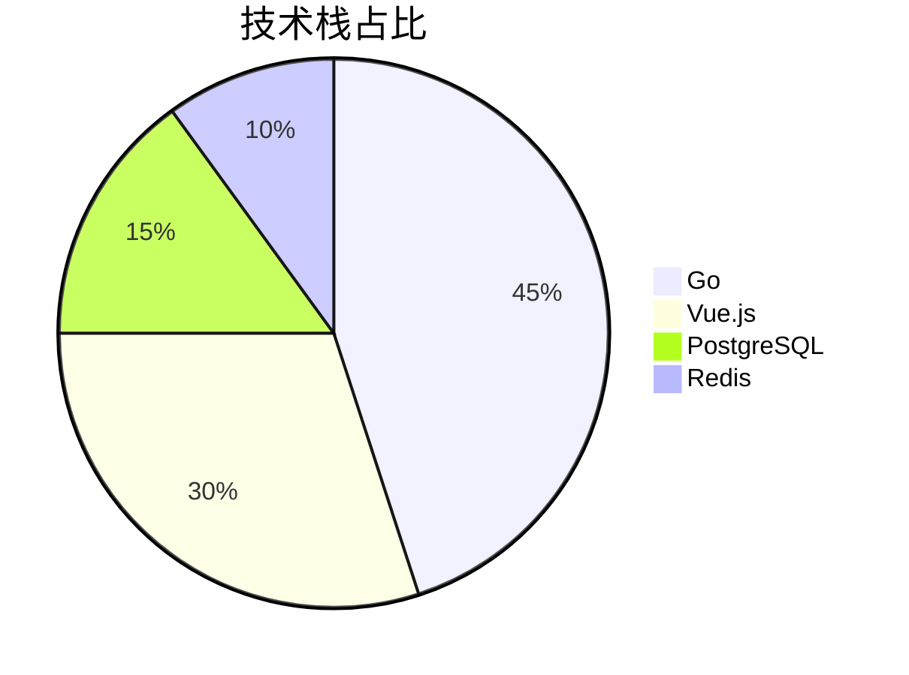

## 思维导图 (Mindmap)

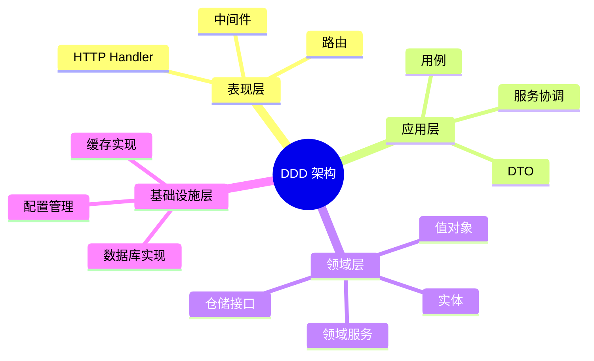

## 时间线 (Timeline)

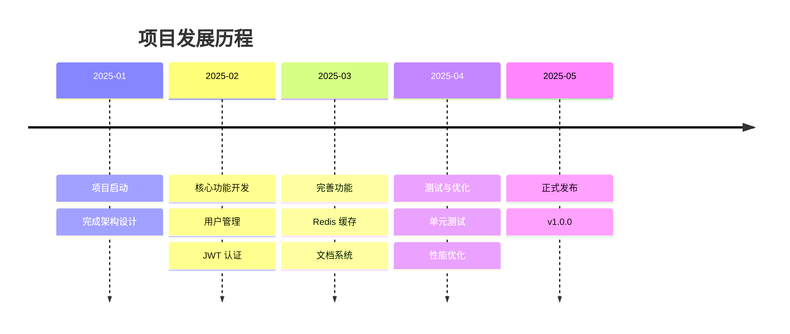

## 使用说明

在 Markdown 文件中使用 Mermaid 图表非常简单，只需使用标准的 Mermaid 代码块语法：

````markdown
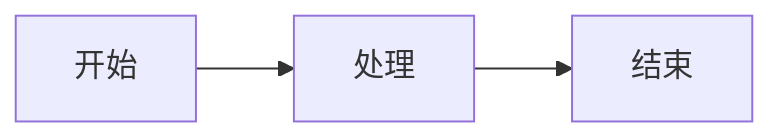
````

VitePress 会自动将其渲染为可交互的图表。

## 特性

- ✅ 支持所有 Mermaid 图表类型
- ✅ 自动适配亮色/暗色主题
- ✅ 响应式设计，适配移动端
- ✅ 与 VitePress 2.0 完美集成
- ✅ 标准 Markdown 代码块语法
- ✅ 保留换行符，语法正确

## 参考资料

- [Mermaid 官方文档](https://mermaid.js.org/)
- [Mermaid 在线编辑器](https://mermaid.live/)
