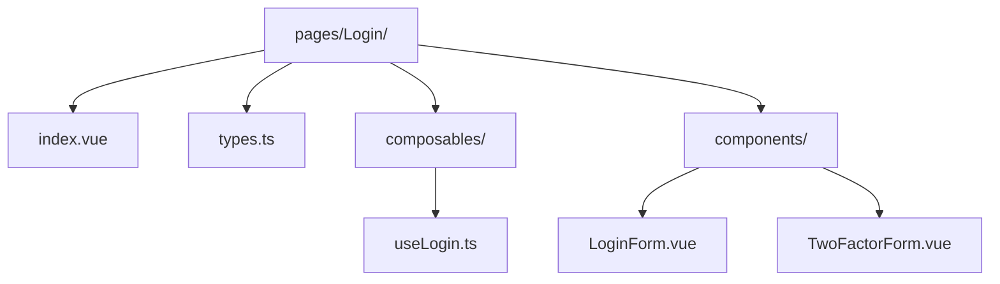
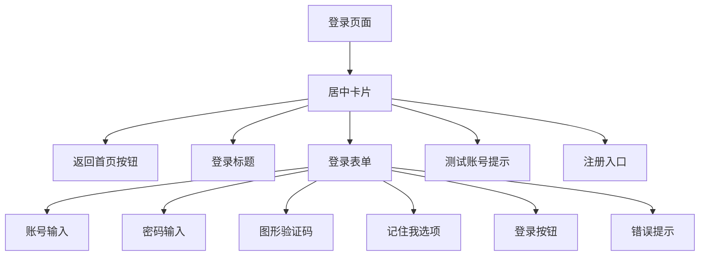
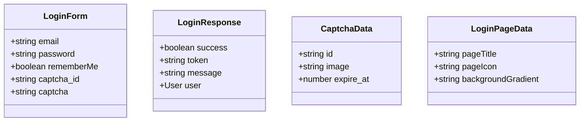
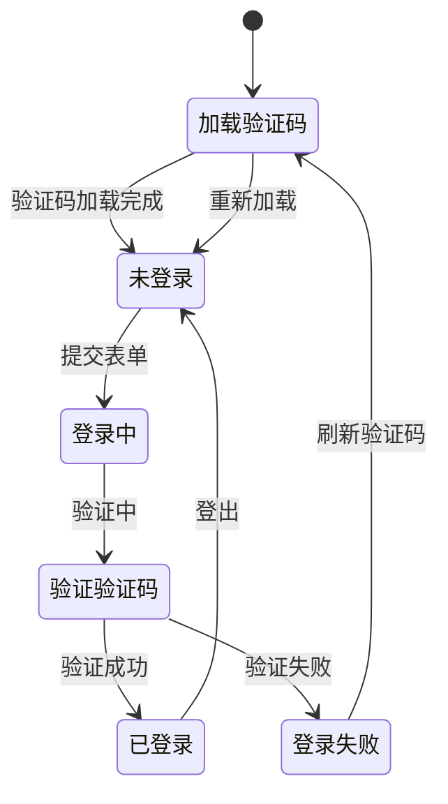
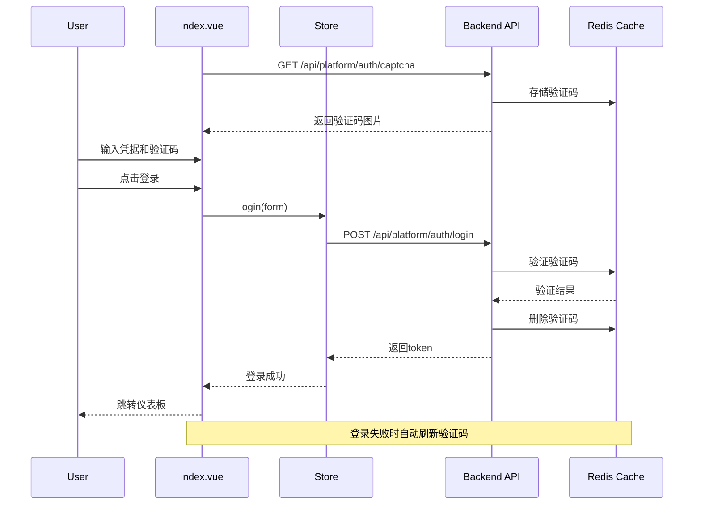

# Login 页面架构说明

## 📁 目录结构



## 🎯 页面职责

提供用户登录功能，采用简洁的居中布局设计

## 🎨 布局设计



### 登录表单组件 (LoginForm.vue)

- 返回首页按钮（卡片内顶部）
- 登录标题
- 账号输入（支持手机号/用户名/邮箱）
- 密码输入
- 图形验证码
- 记住我选项
- 登录按钮
- 错误提示区域
- 测试账号提示（开发环境）
- 注册入口

## 🔐 安全特性

- 图形验证码验证
- 验证码自动刷新
- 验证码一次性使用
- 登录失败自动刷新验证码

## 📋 类型定义 (types.ts)



## 📦 状态管理 (composables/useLogin.ts)

页面级状态管理，使用 Composition API 实现，不依赖 Pinia。

**注意**: 这是页面级 composable，每次调用创建新实例。如果需要全局状态，请使用 `/src/stores/useAuthStore`。



### 使用方式

```typescript
import { useLogin } from "@/views/Auth/Login/composables";

const login = useLogin();
await login.fetchCaptcha();
const result = await login.login();
```

## 🔄 数据流



## 🎨 UI 组件

- 用户名输入框
- 密码输入框
- 验证码输入框
- 验证码图片（可点击刷新）
- 记住我复选框
- 登录按钮
