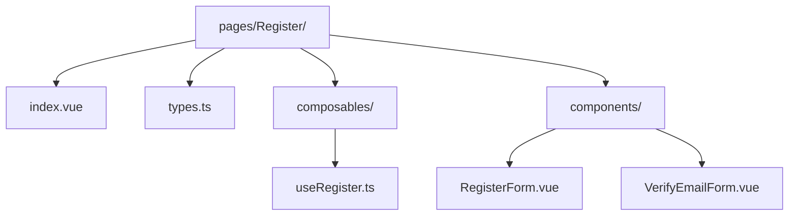
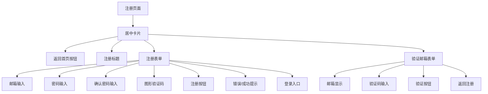
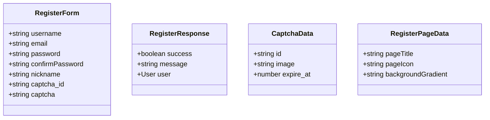
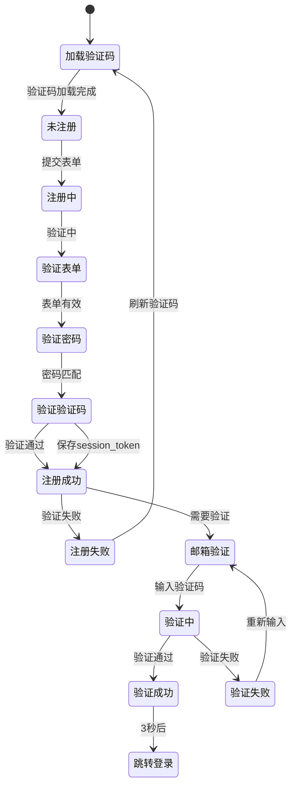
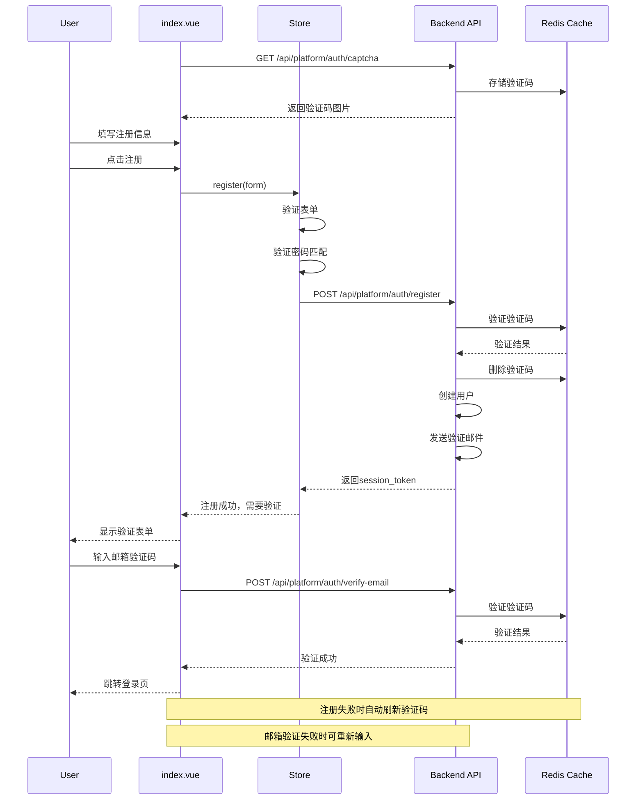

# Register 页面架构说明

## 📁 目录结构



## 🎯 页面职责

提供用户注册功能，采用简洁的居中布局设计 (风格与登录页面一致)

**注意**: 邮箱验证功能已合并到此页面，不再需要独立路由。如果直接访问验证链接 (带 `email` 和 `code` query 参数) ，页面会自动显示验证表单。

## 🎨 布局设计



### 注册表单组件 (RegisterForm.vue)

- 返回首页按钮 (卡片内顶部)
- 注册标题
- 邮箱输入框 (格式验证)
- 密码输入框 (至少 6 个字符)
- 确认密码输入框 (密码匹配验证)
- 图形验证码 (可点击刷新)
- 注册按钮
- 错误/成功提示区域
- 用户协议提示
- 跳转登录按钮

### 邮箱验证表单组件 (VerifyEmailForm.vue)

- 返回注册按钮 (卡片内顶部)
- 验证邮箱标题
- 邮箱地址显示 (从注册表单或 URL 参数获取)
- 验证码输入框 (6 位数字，自动验证)
- 验证按钮
- 成功状态显示 (验证成功后)
- 支持从 URL 参数初始化 (独立访问场景)

## 🔐 安全特性

- 图形验证码验证
- 验证码自动刷新
- 验证码一次性使用
- 密码强度要求 (至少 6 个字符)
- 密码确认验证
- 注册失败自动刷新验证码
- 邮箱验证码验证 (6 位数字)
- **密码管理器兼容性** (1Password、LastPass、Bitwarden 等)
  - 使用标准 `autocomplete` 属性
  - 正确的 `name` 属性设置
  - 支持密码自动生成和填充

## 📋 类型定义 (types.ts)



## 📦 状态管理 (composables/useRegister.ts)

页面级状态管理，使用 Composition API 实现，不依赖 Pinia。

**注意**: 这是页面级 composable，每次调用创建新实例。



### 使用方式

```typescript
import { useRegister } from "@/views/Auth/Register/composables";

const register = useRegister();
await register.fetchCaptcha();
const result = await register.register();
```

## 🔄 数据流



## 🎨 UI 组件架构

### 注册表单组件 (RegisterForm.vue)

- 返回首页按钮 (卡片内顶部)
- 注册标题
- **邮箱输入框** (必填，格式验证)
  - `type="email"`, `name="email"`, `autocomplete="email"`
- **密码输入框** (必填，至少 6 个字符)
  - `type="password"`, `name="password"`, `autocomplete="new-password"`
  - 支持密码管理器生成强密码
- **确认密码输入框** (必填，需要匹配)
  - `type="password"`, `name="confirm-password"`, `autocomplete="new-password"`
  - 支持密码管理器自动填充
- **验证码输入框** (必填)
  - `autocomplete="off"` 防止密码管理器干扰
- 验证码图片 (可点击刷新)
- 注册按钮
- 错误/成功提示区域
- 用户协议提示
- 跳转登录按钮

### 邮箱验证表单组件 (VerifyEmailForm.vue)

- 返回注册按钮 (卡片内顶部)
- 验证邮箱标题
- 邮箱地址显示 (来自注册表单或 URL 参数)
- 验证码输入框 (6 位数字，自动验证)
  - `autocomplete="one-time-code"` 支持密码管理器识别
- 验证按钮
- 成功状态显示 (验证成功后自动跳转)

## 🔄 表单验证

### 实时验证

- ✅ 邮箱包含 @
- ✅ 密码长度 >= 6
- ✅ 确认密码与密码一致
- ✅ 验证码不为空
- ✅ 邮箱验证码长度为 6 位

### 错误提示

- 实时显示错误信息
- 5 秒后自动消失
- 可手动关闭

## 🚀 使用流程

### 注册流程

1. 页面加载，自动获取验证码
2. 用户填写注册信息
3. 实时验证表单字段
4. 提交注册请求
5. 成功后显示提示，切换到验证表单
6. 用户输入邮箱验证码
7. 验证成功后跳转登录页

### 独立访问验证 (从邮件链接)

1. 用户点击邮件中的验证链接 (带 `email` 和 `code` query 参数)
2. 页面自动识别 URL 参数，直接显示验证表单
3. 如果 URL 中有验证码，自动填充并验证
4. 验证成功后跳转登录页

## 📝 注意事项

- 邮箱验证已合并到 Register 页面，不再需要独立路由 `/auth/verify-email`
- 支持从邮件链接直接访问验证 (通过 query 参数)
- Session token 用于注册流程中的验证
- 独立访问场景使用邮箱进行验证
